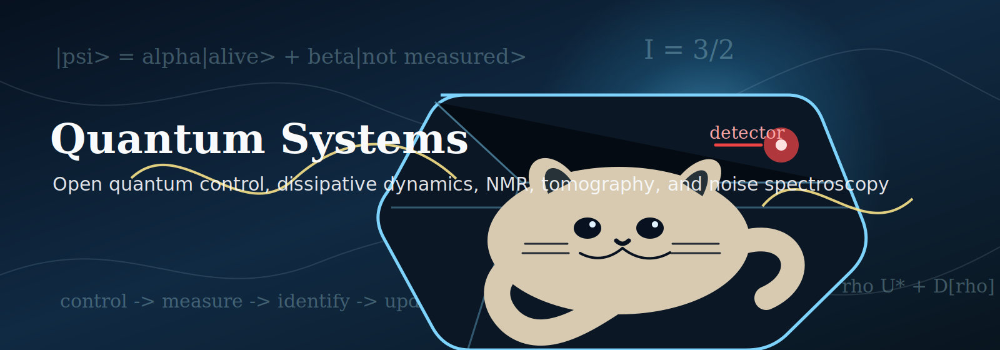

<p align="center">
  
</p>

# Quantum Systems

Python-first laboratory for open quantum systems, dissipative dynamics, NMR,
quantum control, tomography, and noise spectroscopy.

The project started from a Na-23 quadrupolar NMR workflow and was rebuilt as a
reproducible research lab in Python. MATLAB is not part of the active workflow.
The useful physics was ported, tested, and expanded into a clean platform for
simulation, paper reproduction, and future experimental validation.

## Research Theme

**Control and identification of dissipative dynamics in open quantum systems: a
statistical-physics approach with experimental validation.**

The current stack connects:

- spin-3/2 Na-23 NMR modeling;
- FID and spectrum simulation;
- quadrupolar relaxation benchmarks;
- quantum state tomography;
- selective-pulse and GRAPE control;
- dynamical-decoupling filtering;
- noise spectroscopy;
- quantum process tomography;
- gate-set tomography;
- process-tensor memory diagnostics;
- a single experimental decision pipeline for future lab data.

## Repository Structure

```text
src/oqs_control/                         validated Python package
scripts/                                 one-command runs and build utilities
tests/                                   physics and numerical regression tests
docs/LAB_MANUAL.md                       compact lab manual
docs/papers/                             one Markdown file per paper/workflow with figure guide
outputs/repro/                           reproducible JSON/PNG paper artifacts
outputs/workflows/                       experimental-decision workflow artifacts
reports/review_article/                  LaTeX/PDF review-style report
data/reference/                          current Na-23 reference data
lab/research_memory/                     generated research-memory index
```

## Quick Start

```powershell
python -m pip install -r requirements.txt
$env:PYTHONPATH='src'
python -m pytest -q
```

Run the experimental decision pipeline:

```powershell
$env:PYTHONPATH='src'
python scripts\run_experimental_decision_pipeline.py
```

Build the review article:

```powershell
python scripts\build_review_article.py
```

Update the research memory:

```powershell
$env:PYTHONPATH='src'
python scripts\research_memory_agent.py
```

## Main Documents

```text
docs/LAB_MANUAL.md
docs/papers/
reports/review_article/open_quantum_control_review.pdf
reports/review_article/open_quantum_control_review.tex
GUIDE.md
```

## Current Reproduced Research Stack

The repository includes compact notes and reproducible artifacts for:

- Na-23 relaxometry and quadrupolar relaxation;
- spin-3/2 algebraic NMR dynamics;
- relaxation dynamics by quantum state tomography;
- spin-3/2 logical operations monitored by QST;
- non-Markovian noise diagnostics;
- multipass quantum process tomography;
- quadrupolar NMR quantum information processing;
- GRAPE NMR optimal control;
- pseudo-pure state preparation by optimal control;
- projected least-squares QPT;
- gate-set tomography;
- process-tensor characterization and control;
- dynamical-decoupling noise filtering;
- DD noise spectroscopy;
- flux-qubit-like noise spectroscopy.

## Scientific Status

Validated:

- spin-3/2 operator algebra;
- Na-23 Hamiltonian and transition structure;
- synthetic FID/spectrum generation;
- synthetic QST reconstruction;
- synthetic dissipative-rate recovery;
- paper-reproduction metrics and figures;
- experimental-decision workflow under synthetic data.

Not yet claimed:

- microscopic identification from a single real FID;
- final T1/T2 relaxometry on real data;
- full experimental seven-phase tomography;
- hardware-level calibration of SPAM/readout/pulse errors;
- experimental optimality of any selected control sequence.

## License

MIT License. See `LICENSE`.
