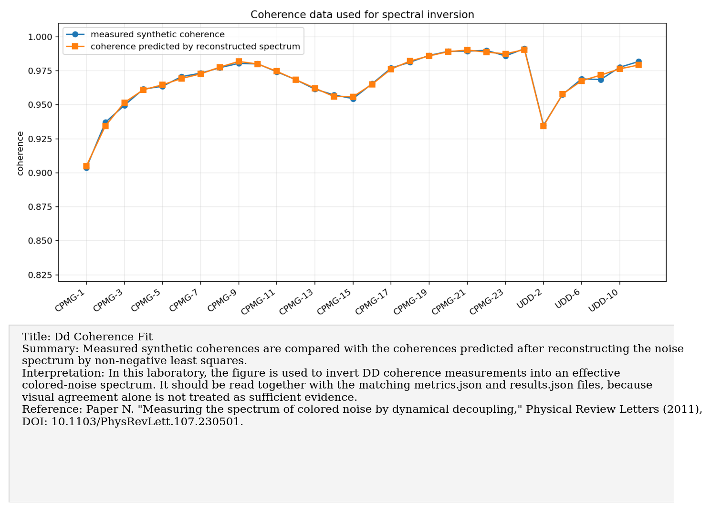
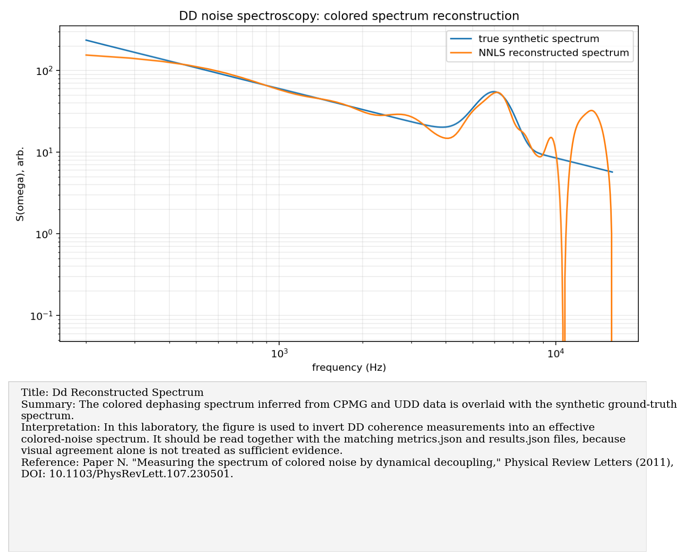
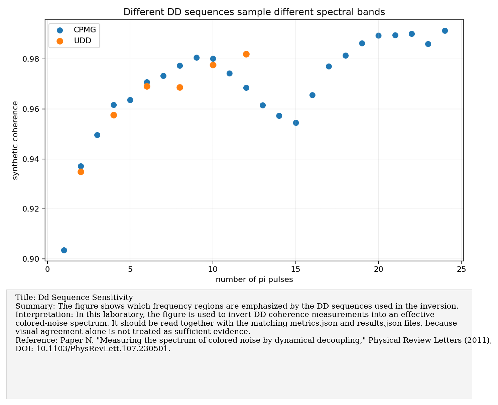
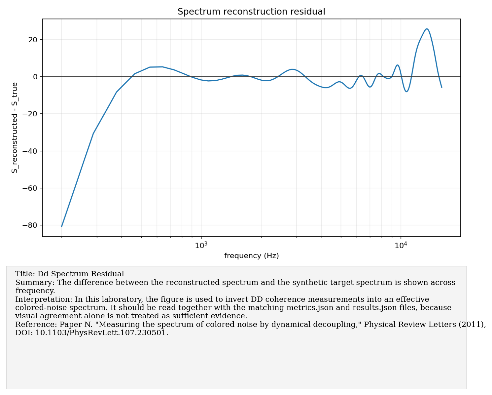

# Paper N: Colored-noise spectroscopy by dynamical decoupling

Paper/workflow ID: `dd_noise_spectroscopy_2011`

Category: `DD spectroscopy`

## Primary Reference

Paper N. "Measuring the spectrum of colored noise by dynamical decoupling," Physical Review Letters (2011), DOI: 10.1103/PhysRevLett.107.230501.

## Article Summary

This paper uses dynamical decoupling not only to suppress noise but to measure its spectrum. Different pulse sequences sample different spectral bands, allowing reconstruction of colored noise from coherence measurements.

## Scientific Insights

The central insight is inversion: coherence decay under known filters can be converted into constraints on S(omega). The problem is ill-conditioned, so positivity and sequence coverage matter.

## Implemented Laboratory Model

Non-negative least-squares reconstruction from CPMG/UDD coherences.

## Direct Laboratory Comparison

Our NNLS reconstruction recovered the broad colored structure and localized a narrow spectral feature within the synthetic grid resolution. This method feeds the experimental-decision pipeline.

## Project Lesson

DD data can reconstruct colored spectra and feed control-sequence decisions.

## Next Laboratory Use

Collect coherence under a planned family of CPMG/UDD sequences, reconstruct the spectrum, then select the sequence predicted to preserve coherence best.

## Known Limitations

The inverse problem is ill-conditioned and depends on sequence coverage and pulse ideality.

## Key Metrics

- `reconstruction_summary.spectrum_correlation`: `0.922895`
- `reconstruction_summary.relative_spectrum_error`: `0.311457`

## Figure Guide

### Figure 1. Dd Coherence Fit

- Summary: Measured synthetic coherences are compared with the coherences predicted after reconstructing the noise spectrum by non-negative least squares.
- Interpretation: In this laboratory, the figure is used to invert DD coherence measurements into an effective colored-noise spectrum. It should be read together with the matching metrics.json and results.json files, because visual agreement alone is not treated as sufficient evidence.
- Reference: Paper N. "Measuring the spectrum of colored noise by dynamical decoupling," Physical Review Letters (2011), DOI: 10.1103/PhysRevLett.107.230501.

### Figure 2. Dd Reconstructed Spectrum

- Summary: The colored dephasing spectrum inferred from CPMG and UDD data is overlaid with the synthetic ground-truth spectrum.
- Interpretation: In this laboratory, the figure is used to invert DD coherence measurements into an effective colored-noise spectrum. It should be read together with the matching metrics.json and results.json files, because visual agreement alone is not treated as sufficient evidence.
- Reference: Paper N. "Measuring the spectrum of colored noise by dynamical decoupling," Physical Review Letters (2011), DOI: 10.1103/PhysRevLett.107.230501.

### Figure 3. Dd Sequence Sensitivity

- Summary: The figure shows which frequency regions are emphasized by the DD sequences used in the inversion.
- Interpretation: In this laboratory, the figure is used to invert DD coherence measurements into an effective colored-noise spectrum. It should be read together with the matching metrics.json and results.json files, because visual agreement alone is not treated as sufficient evidence.
- Reference: Paper N. "Measuring the spectrum of colored noise by dynamical decoupling," Physical Review Letters (2011), DOI: 10.1103/PhysRevLett.107.230501.

### Figure 4. Dd Spectrum Residual

- Summary: The difference between the reconstructed spectrum and the synthetic target spectrum is shown across frequency.
- Interpretation: In this laboratory, the figure is used to invert DD coherence measurements into an effective colored-noise spectrum. It should be read together with the matching metrics.json and results.json files, because visual agreement alone is not treated as sufficient evidence.
- Reference: Paper N. "Measuring the spectrum of colored noise by dynamical decoupling," Physical Review Letters (2011), DOI: 10.1103/PhysRevLett.107.230501.

## Canonical Artifacts

- Metrics: `outputs/repro/dd_noise_spectroscopy_2011/latest/metrics.json`
- Config: `outputs/repro/dd_noise_spectroscopy_2011/latest/config_used.json`
- Results: `outputs/repro/dd_noise_spectroscopy_2011/latest/results.json`
