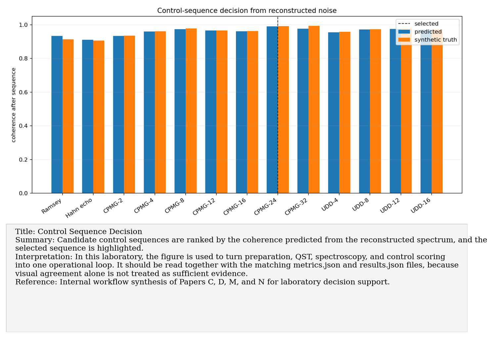
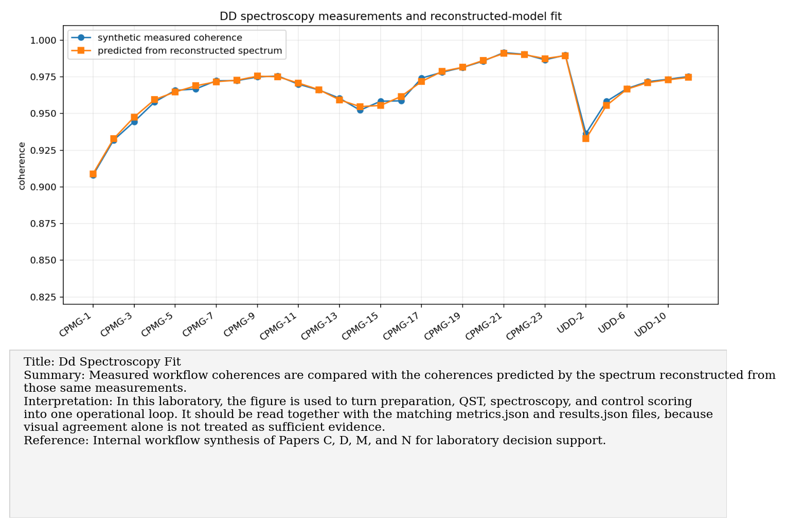
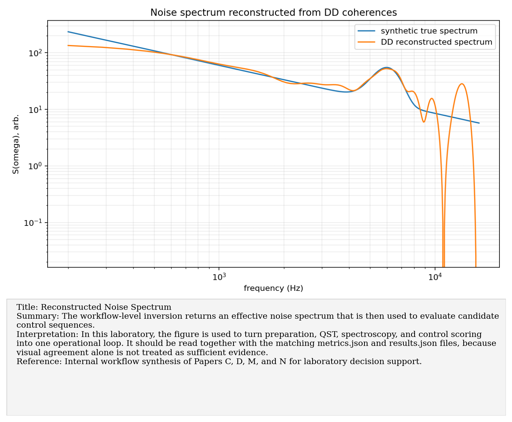
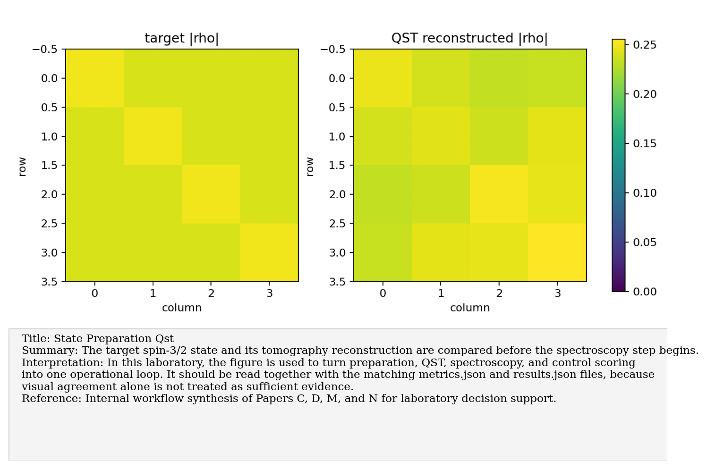

# Workflow: Experimental decision pipeline

Paper/workflow ID: `experimental_decision_pipeline`

Category: `Lab operations`

## Primary Reference

Internal workflow synthesis of Papers C, D, M, and N for laboratory decision support.

## Article Summary

The pipeline is not a paper; it is the operational synthesis of the papers. It prepares a state, validates QST, simulates or ingests DD coherences, reconstructs an effective spectrum, chooses a control sequence, and prepares comparison templates for real data.

## Scientific Insights

The insight is that research must become a decision loop. The lab should not only simulate papers; it should decide what to measure next and how to falsify or refine the model.

## Implemented Laboratory Model

Synthetic QST plus DD spectral inversion and candidate sequence scoring.

## Direct Laboratory Comparison

The current synthetic run selects CPMG-24 and records the status as waiting for lab data. Once real coherences arrive, the same pipeline reports residuals and decides whether the model is sufficient.

## Project Lesson

The paper reproductions now form a single operational decision loop.

## Next Laboratory Use

Use this as the default entry point for incoming experiments: fill the manifest, run the pipeline, inspect residuals, and update research memory.

## Known Limitations

Waiting for real lab data; current decision is synthetic.

## Key Metrics

- `state_preparation_summary.qst_fidelity`: `0.985594`
- `decision_summary.selected_predicted_coherence`: `0.989469`

## Figure Guide

### Figure 1. Control Sequence Decision

- Summary: Candidate control sequences are ranked by the coherence predicted from the reconstructed spectrum, and the selected sequence is highlighted.
- Interpretation: In this laboratory, the figure is used to turn preparation, QST, spectroscopy, and control scoring into one operational loop. It should be read together with the matching metrics.json and results.json files, because visual agreement alone is not treated as sufficient evidence.
- Reference: Internal workflow synthesis of Papers C, D, M, and N for laboratory decision support.

### Figure 2. Dd Spectroscopy Fit

- Summary: Measured workflow coherences are compared with the coherences predicted by the spectrum reconstructed from those same measurements.
- Interpretation: In this laboratory, the figure is used to turn preparation, QST, spectroscopy, and control scoring into one operational loop. It should be read together with the matching metrics.json and results.json files, because visual agreement alone is not treated as sufficient evidence.
- Reference: Internal workflow synthesis of Papers C, D, M, and N for laboratory decision support.

### Figure 3. Reconstructed Noise Spectrum

- Summary: The workflow-level inversion returns an effective noise spectrum that is then used to evaluate candidate control sequences.
- Interpretation: In this laboratory, the figure is used to turn preparation, QST, spectroscopy, and control scoring into one operational loop. It should be read together with the matching metrics.json and results.json files, because visual agreement alone is not treated as sufficient evidence.
- Reference: Internal workflow synthesis of Papers C, D, M, and N for laboratory decision support.

### Figure 4. State Preparation Qst

- Summary: The target spin-3/2 state and its tomography reconstruction are compared before the spectroscopy step begins.
- Interpretation: In this laboratory, the figure is used to turn preparation, QST, spectroscopy, and control scoring into one operational loop. It should be read together with the matching metrics.json and results.json files, because visual agreement alone is not treated as sufficient evidence.
- Reference: Internal workflow synthesis of Papers C, D, M, and N for laboratory decision support.

## Canonical Artifacts

- Metrics: `outputs/workflows/experimental_decision_pipeline/latest/metrics.json`
- Config: `outputs/workflows/experimental_decision_pipeline/latest/config_used.json`
- Results: `outputs/workflows/experimental_decision_pipeline/latest/results.json`
