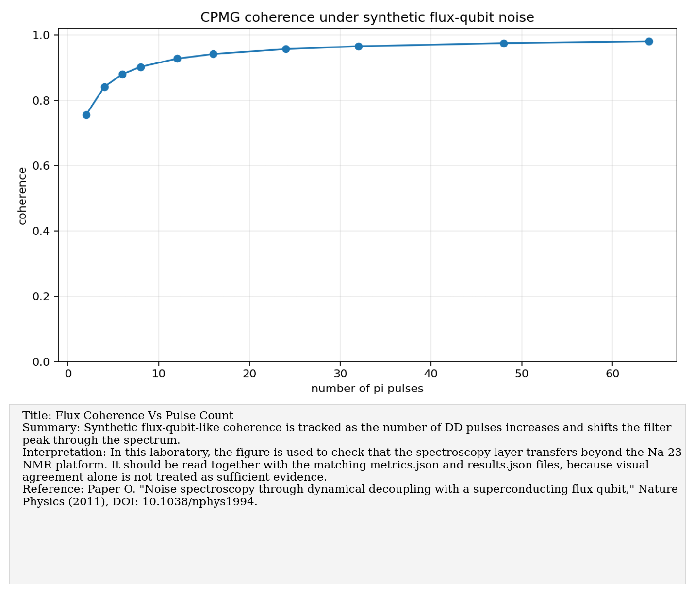
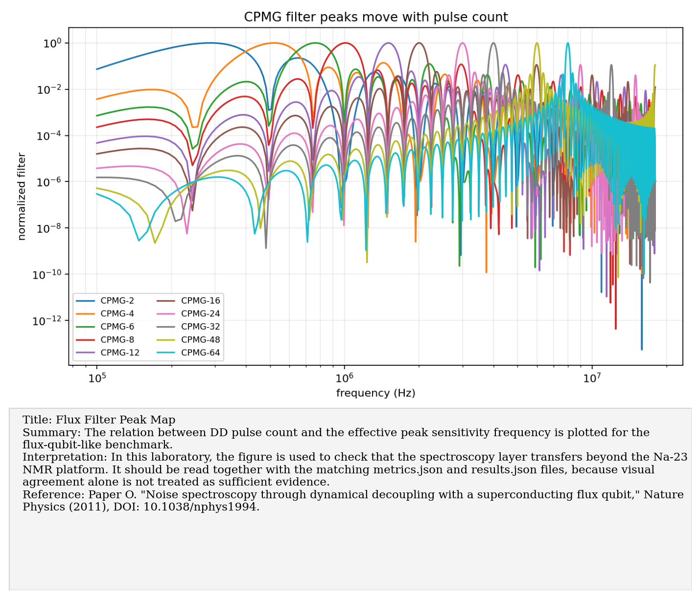
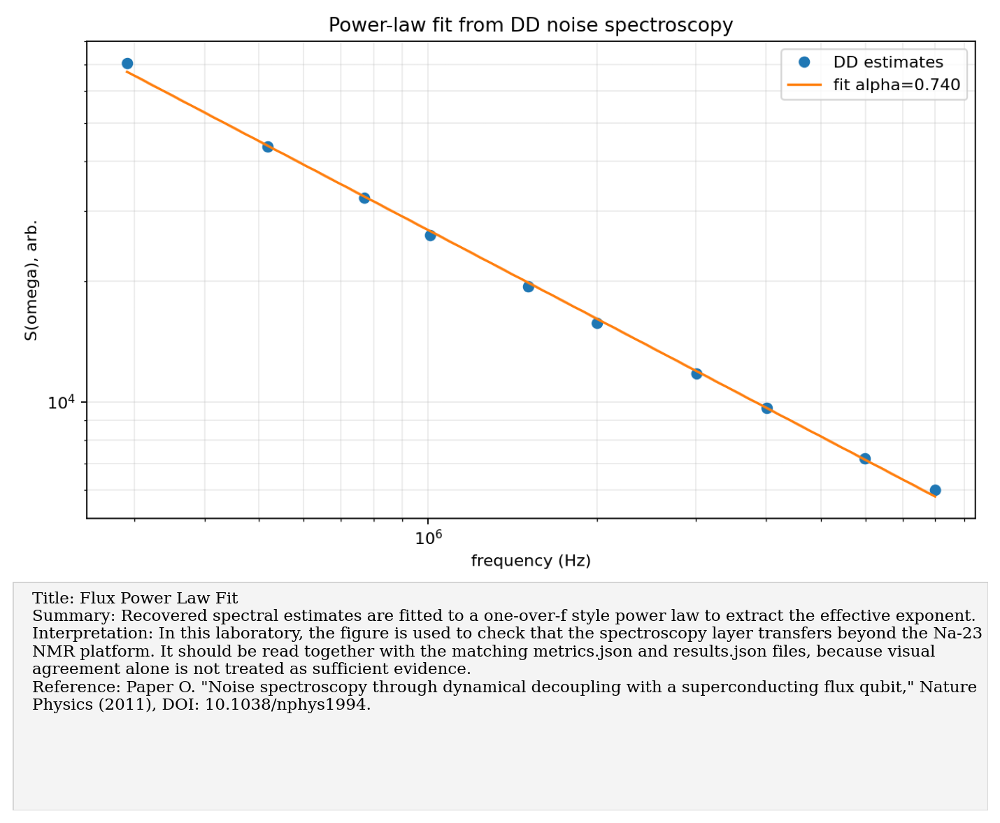
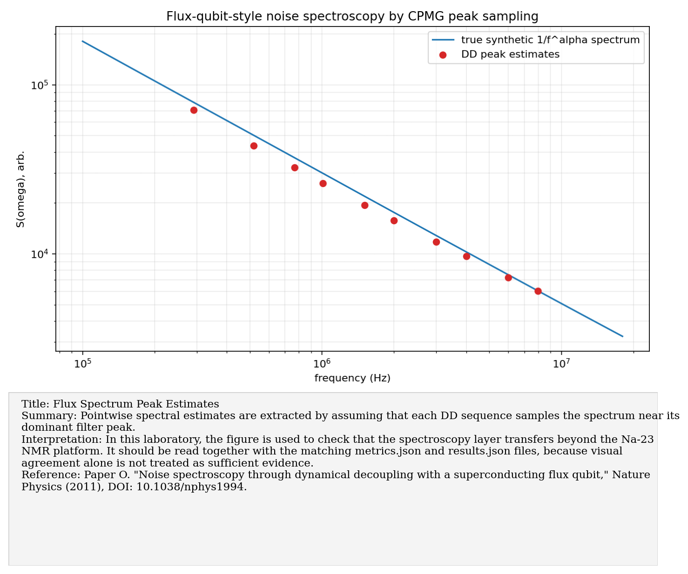

# Paper O: Flux-qubit noise spectroscopy through DD

Paper/workflow ID: `flux_qubit_noise_spectroscopy_2011`

Category: `Hardware noise spectroscopy`

## Primary Reference

Paper O. "Noise spectroscopy through dynamical decoupling with a superconducting flux qubit," Nature Physics (2011), DOI: 10.1038/nphys1994.

## Article Summary

This paper applies DD noise spectroscopy to a superconducting flux qubit and estimates a 1/f-like noise spectrum. It matters for this project because it shows that the DD spectroscopy logic is not platform-specific.

## Scientific Insights

The insight is portability: if the control filters and coherence model are known, the same inverse logic can apply to NMR spins or superconducting qubits, with platform-specific calibration.

## Implemented Laboratory Model

CPMG peak-filter estimates fitted to a synthetic 1/f^alpha spectrum.

## Direct Laboratory Comparison

Our synthetic flux-qubit-like benchmark estimated the exponent alpha from peak-filter samples. It validates the repository's hardware-facing direction beyond Na-23.

## Project Lesson

The spectroscopy layer is platform-independent in structure.

## Next Laboratory Use

Use this as the bridge when Ygor has access to gate-model quantum hardware: treat coherence experiments as spectral probes, not only as benchmark scores.

## Known Limitations

Synthetic flux-qubit-like data; not hardware-acquired data.

## Key Metrics

- `spectroscopy_summary.estimated_alpha`: `0.739918`
- `spectroscopy_summary.alpha_abs_error`: `0.0400821`

## Figure Guide

### Figure 1. Flux Coherence Vs Pulse Count

- Summary: Synthetic flux-qubit-like coherence is tracked as the number of DD pulses increases and shifts the filter peak through the spectrum.
- Interpretation: In this laboratory, the figure is used to check that the spectroscopy layer transfers beyond the Na-23 NMR platform. It should be read together with the matching metrics.json and results.json files, because visual agreement alone is not treated as sufficient evidence.
- Reference: Paper O. "Noise spectroscopy through dynamical decoupling with a superconducting flux qubit," Nature Physics (2011), DOI: 10.1038/nphys1994.

### Figure 2. Flux Filter Peak Map

- Summary: The relation between DD pulse count and the effective peak sensitivity frequency is plotted for the flux-qubit-like benchmark.
- Interpretation: In this laboratory, the figure is used to check that the spectroscopy layer transfers beyond the Na-23 NMR platform. It should be read together with the matching metrics.json and results.json files, because visual agreement alone is not treated as sufficient evidence.
- Reference: Paper O. "Noise spectroscopy through dynamical decoupling with a superconducting flux qubit," Nature Physics (2011), DOI: 10.1038/nphys1994.

### Figure 3. Flux Power Law Fit

- Summary: Recovered spectral estimates are fitted to a one-over-f style power law to extract the effective exponent.
- Interpretation: In this laboratory, the figure is used to check that the spectroscopy layer transfers beyond the Na-23 NMR platform. It should be read together with the matching metrics.json and results.json files, because visual agreement alone is not treated as sufficient evidence.
- Reference: Paper O. "Noise spectroscopy through dynamical decoupling with a superconducting flux qubit," Nature Physics (2011), DOI: 10.1038/nphys1994.

### Figure 4. Flux Spectrum Peak Estimates

- Summary: Pointwise spectral estimates are extracted by assuming that each DD sequence samples the spectrum near its dominant filter peak.
- Interpretation: In this laboratory, the figure is used to check that the spectroscopy layer transfers beyond the Na-23 NMR platform. It should be read together with the matching metrics.json and results.json files, because visual agreement alone is not treated as sufficient evidence.
- Reference: Paper O. "Noise spectroscopy through dynamical decoupling with a superconducting flux qubit," Nature Physics (2011), DOI: 10.1038/nphys1994.

## Canonical Artifacts

- Metrics: `outputs/repro/flux_qubit_noise_spectroscopy_2011/latest/metrics.json`
- Config: `outputs/repro/flux_qubit_noise_spectroscopy_2011/latest/config_used.json`
- Results: `outputs/repro/flux_qubit_noise_spectroscopy_2011/latest/results.json`
