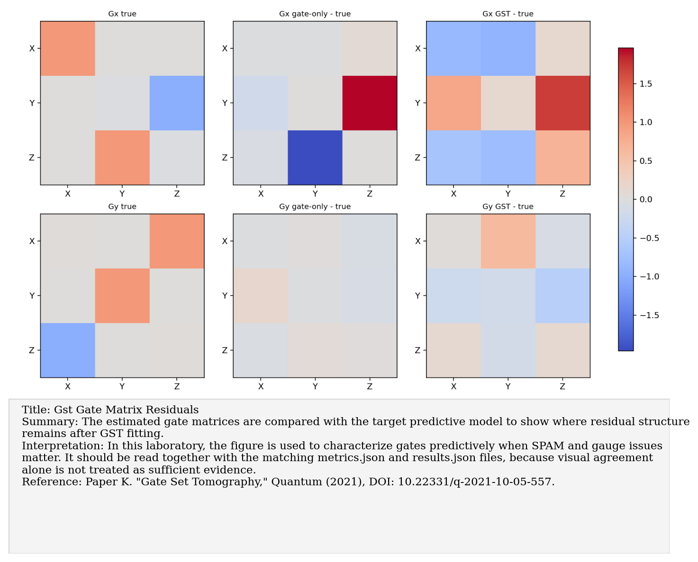
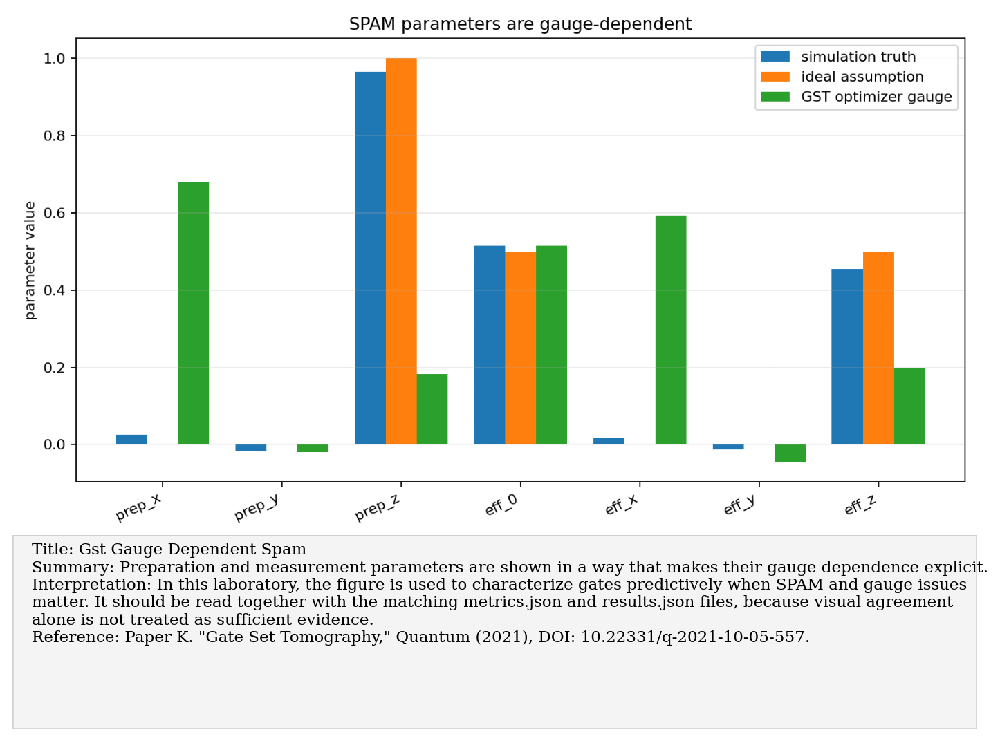
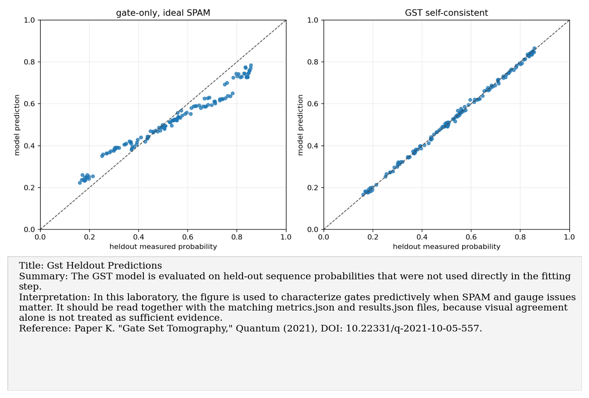
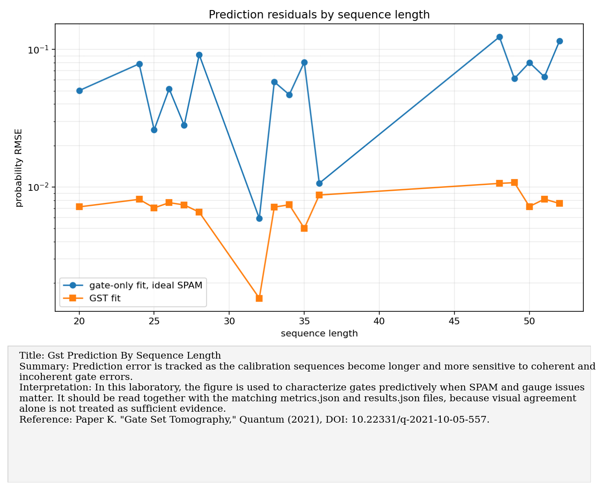

# Paper K: Gate set tomography

Paper/workflow ID: `gate_set_tomography_2021`

Category: `SPAM-aware tomography`

## Primary Reference

Paper K. "Gate Set Tomography," Quantum (2021), DOI: 10.22331/q-2021-10-05-557.

## Article Summary

Gate-set tomography models state preparation, gates, and measurements self-consistently. It avoids assuming that SPAM operations are ideal, which is often false in real hardware and can bias ordinary QPT.

## Scientific Insights

The key insight is that errors are gauge-structured. Direct gate matrices are not always uniquely meaningful, so predictive probabilities and held-out likelihoods are safer comparison targets.

## Implemented Laboratory Model

Minimal GST-like fitting of gates, preparation, and measurement through sequence probabilities.

## Direct Laboratory Comparison

Our minimal GST-like benchmark compared ideal-SPAM gate-only fitting with self-consistent fitting. The GST model greatly improved held-out prediction accuracy.

## Project Lesson

Predictive probabilities are safer than direct gate parameters because GST has gauge freedom.

## Next Laboratory Use

Use GST when hardware data show that preparation/readout errors cannot be ignored or when ordinary QPT gives inconsistent gate estimates.

## Known Limitations

Minimal benchmark, not a full pyGSTi-level implementation.

## Key Metrics

- `prediction_summary.heldout_improvement_factor`: `8.59956`
- `prediction_summary.heldout_rmse_gst`: `0.00761847`

## Figure Guide

### Figure 1. Gst Gate Matrix Residuals

- Summary: The estimated gate matrices are compared with the target predictive model to show where residual structure remains after GST fitting.
- Interpretation: In this laboratory, the figure is used to characterize gates predictively when SPAM and gauge issues matter. It should be read together with the matching metrics.json and results.json files, because visual agreement alone is not treated as sufficient evidence.
- Reference: Paper K. "Gate Set Tomography," Quantum (2021), DOI: 10.22331/q-2021-10-05-557.

### Figure 2. Gst Gauge Dependent Spam

- Summary: Preparation and measurement parameters are shown in a way that makes their gauge dependence explicit.
- Interpretation: In this laboratory, the figure is used to characterize gates predictively when SPAM and gauge issues matter. It should be read together with the matching metrics.json and results.json files, because visual agreement alone is not treated as sufficient evidence.
- Reference: Paper K. "Gate Set Tomography," Quantum (2021), DOI: 10.22331/q-2021-10-05-557.

### Figure 3. Gst Heldout Predictions

- Summary: The GST model is evaluated on held-out sequence probabilities that were not used directly in the fitting step.
- Interpretation: In this laboratory, the figure is used to characterize gates predictively when SPAM and gauge issues matter. It should be read together with the matching metrics.json and results.json files, because visual agreement alone is not treated as sufficient evidence.
- Reference: Paper K. "Gate Set Tomography," Quantum (2021), DOI: 10.22331/q-2021-10-05-557.

### Figure 4. Gst Prediction By Sequence Length

- Summary: Prediction error is tracked as the calibration sequences become longer and more sensitive to coherent and incoherent gate errors.
- Interpretation: In this laboratory, the figure is used to characterize gates predictively when SPAM and gauge issues matter. It should be read together with the matching metrics.json and results.json files, because visual agreement alone is not treated as sufficient evidence.
- Reference: Paper K. "Gate Set Tomography," Quantum (2021), DOI: 10.22331/q-2021-10-05-557.

## Canonical Artifacts

- Metrics: `outputs/repro/gate_set_tomography_2021/latest/metrics.json`
- Config: `outputs/repro/gate_set_tomography_2021/latest/config_used.json`
- Results: `outputs/repro/gate_set_tomography_2021/latest/results.json`
