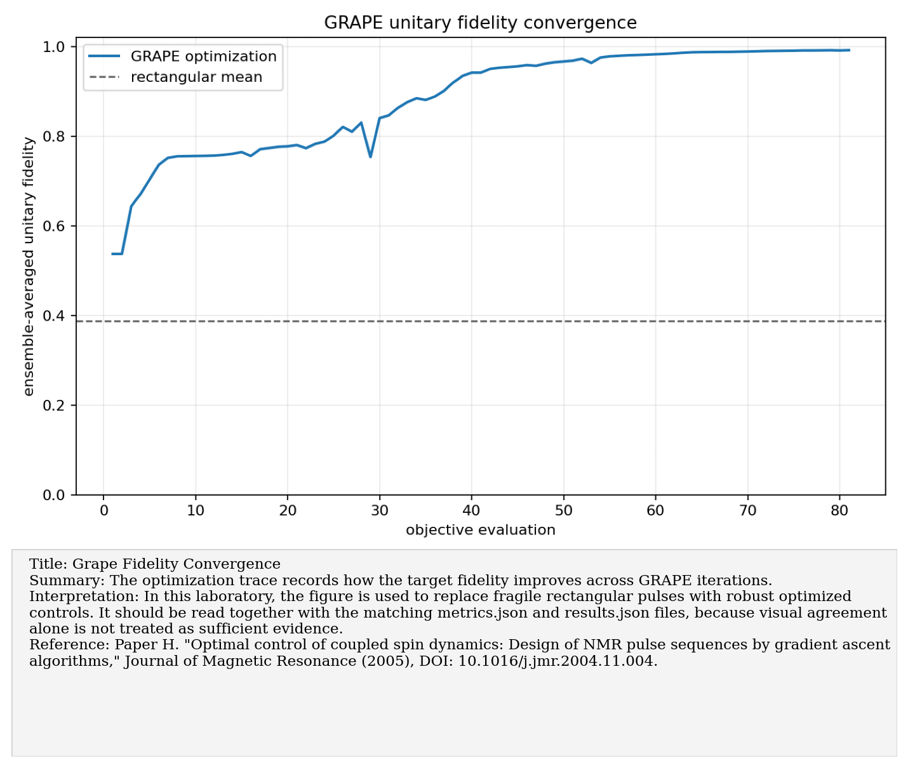
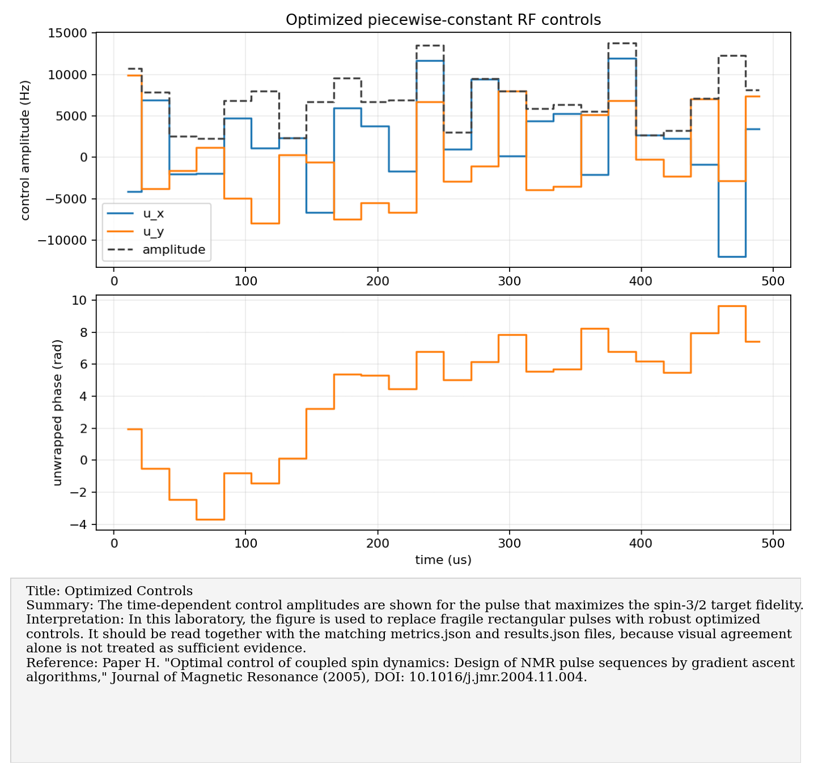
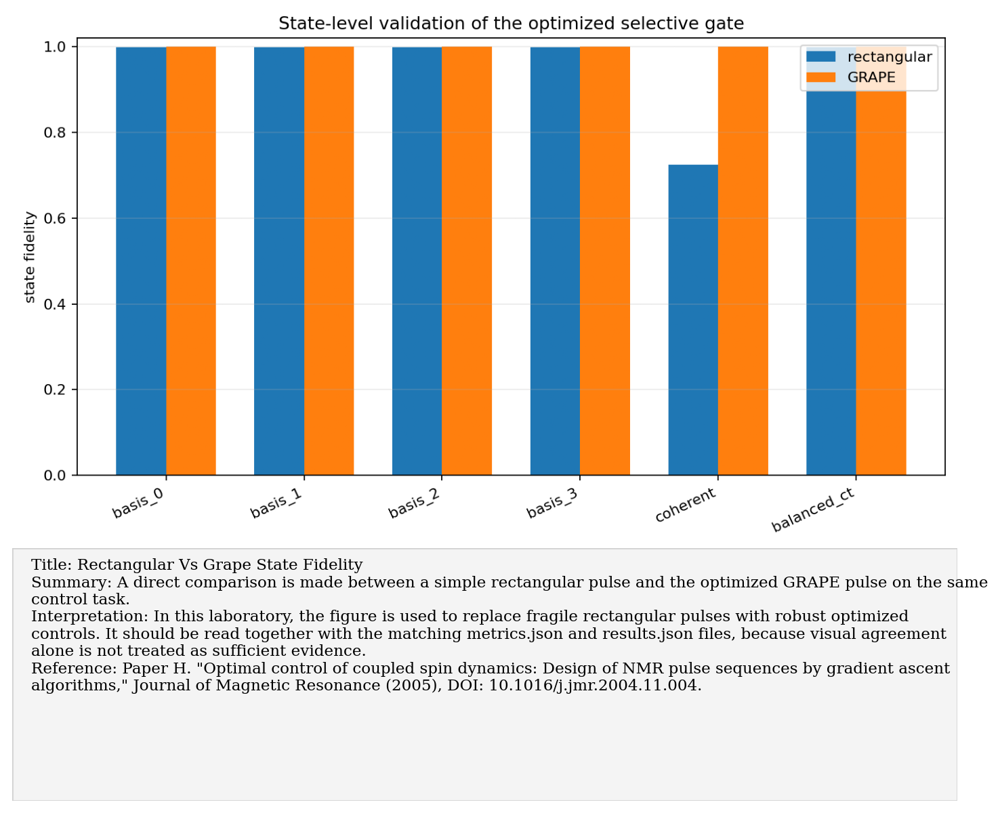
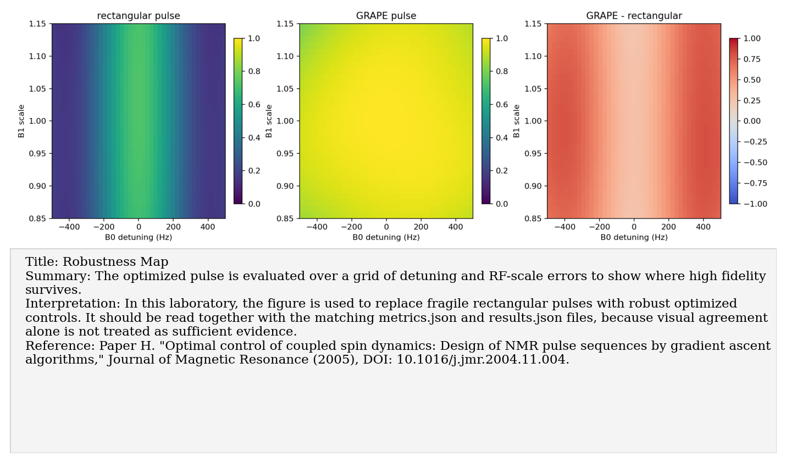

# Paper H: GRAPE NMR optimal control

Paper/workflow ID: `grape_nmr_control_2005`

Category: `Optimal control`

## Primary Reference

Paper H. "Optimal control of coupled spin dynamics: Design of NMR pulse sequences by gradient ascent algorithms," Journal of Magnetic Resonance (2005), DOI: 10.1016/j.jmr.2004.11.004.

## Article Summary

The GRAPE paper introduces gradient-based optimal control for NMR pulse design. It is the natural response to finite-pulse failures because it optimizes the full pulse shape under a modeled Hamiltonian rather than relying on ideal rectangular rotations.

## Scientific Insights

The central insight is that high-fidelity control is an optimization problem constrained by drift, control amplitudes, robustness requirements, and ensemble errors. Pulse design should include the physics that would otherwise appear as systematic gate error.

## Implemented Laboratory Model

GRAPE unitary optimization over detuning and RF-scale ensemble members.

## Direct Laboratory Comparison

Our reproduction directly compared a rectangular pulse to a GRAPE-optimized pulse on the spin-3/2 platform. The optimized pulse improved mean robustness-grid fidelity and fixed the failure mode exposed by Paper D.

## Project Lesson

Robust pulse design is necessary for high-fidelity quadrupolar spin-3/2 operations.

## Next Laboratory Use

After measuring real B0/B1 offsets and RF limits, train GRAPE pulses against those calibrated uncertainties and validate them with QST.

## Known Limitations

Optimization is synthetic and does not yet include measured hardware transfer functions.

## Key Metrics

- `optimization.final_training_mean_fidelity`: `0.991512`
- `robustness_grid.grape.mean`: `0.96249`

## Figure Guide

### Figure 1. Grape Fidelity Convergence

- Summary: The optimization trace records how the target fidelity improves across GRAPE iterations.
- Interpretation: In this laboratory, the figure is used to replace fragile rectangular pulses with robust optimized controls. It should be read together with the matching metrics.json and results.json files, because visual agreement alone is not treated as sufficient evidence.
- Reference: Paper H. "Optimal control of coupled spin dynamics: Design of NMR pulse sequences by gradient ascent algorithms," Journal of Magnetic Resonance (2005), DOI: 10.1016/j.jmr.2004.11.004.

### Figure 2. Optimized Controls

- Summary: The time-dependent control amplitudes are shown for the pulse that maximizes the spin-3/2 target fidelity.
- Interpretation: In this laboratory, the figure is used to replace fragile rectangular pulses with robust optimized controls. It should be read together with the matching metrics.json and results.json files, because visual agreement alone is not treated as sufficient evidence.
- Reference: Paper H. "Optimal control of coupled spin dynamics: Design of NMR pulse sequences by gradient ascent algorithms," Journal of Magnetic Resonance (2005), DOI: 10.1016/j.jmr.2004.11.004.

### Figure 3. Rectangular Vs Grape State Fidelity

- Summary: A direct comparison is made between a simple rectangular pulse and the optimized GRAPE pulse on the same control task.
- Interpretation: In this laboratory, the figure is used to replace fragile rectangular pulses with robust optimized controls. It should be read together with the matching metrics.json and results.json files, because visual agreement alone is not treated as sufficient evidence.
- Reference: Paper H. "Optimal control of coupled spin dynamics: Design of NMR pulse sequences by gradient ascent algorithms," Journal of Magnetic Resonance (2005), DOI: 10.1016/j.jmr.2004.11.004.

### Figure 4. Robustness Map

- Summary: The optimized pulse is evaluated over a grid of detuning and RF-scale errors to show where high fidelity survives.
- Interpretation: In this laboratory, the figure is used to replace fragile rectangular pulses with robust optimized controls. It should be read together with the matching metrics.json and results.json files, because visual agreement alone is not treated as sufficient evidence.
- Reference: Paper H. "Optimal control of coupled spin dynamics: Design of NMR pulse sequences by gradient ascent algorithms," Journal of Magnetic Resonance (2005), DOI: 10.1016/j.jmr.2004.11.004.

## Canonical Artifacts

- Metrics: `outputs/repro/grape_nmr_control_2005/latest/metrics.json`
- Config: `outputs/repro/grape_nmr_control_2005/latest/config_used.json`
- Results: `outputs/repro/grape_nmr_control_2005/latest/results.json`
