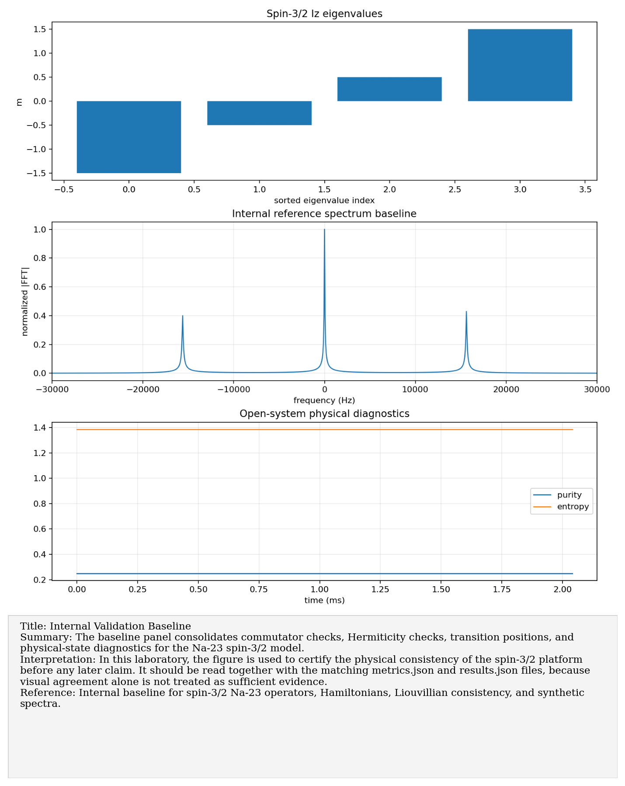

# Internal Baseline: Internal spin-3/2 Na-23 validation baseline

Paper/workflow ID: `internal_validation_baseline`

Category: `Internal validation`

## Primary Reference

Internal baseline for spin-3/2 Na-23 operators, Hamiltonians, Liouvillian consistency, and synthetic spectra.

## Article Summary

This is the laboratory's internal control experiment rather than an external article. It defines the minimum physical consistency conditions required before any paper reproduction or experimental interpretation is trusted.

## Scientific Insights

The central insight is methodological: a wrong commutator, non-Hermitian Hamiltonian, shifted synthetic transition, or non-positive density matrix would contaminate every later result. The baseline therefore treats algebra, spectra, and physical-state evolution as first-class scientific artifacts.

## Implemented Laboratory Model

Spin operators, Hamiltonian scales, synthetic spectra, and Liouvillian checks.

## Direct Laboratory Comparison

The baseline is the reference layer against which all paper reproductions are compared. If a later paper seems to disagree with the platform, the first check is whether the baseline assumptions, units, phase conventions, or FFT conventions were changed.

## Project Lesson

No reproduction should be trusted until the spin-3/2 algebra and spectrum basics pass.

## Next Laboratory Use

Before importing a new TNT file, pulse sequence, or tomography series, rerun the baseline and record the hashes in research memory.

## Known Limitations

This is an internal benchmark, not an external paper reproduction.

## Key Metrics

- No numeric metrics are currently available.

## Figure Guide

### Figure 1. Internal Validation Baseline

- Summary: The baseline panel consolidates commutator checks, Hermiticity checks, transition positions, and physical-state diagnostics for the Na-23 spin-3/2 model.
- Interpretation: In this laboratory, the figure is used to certify the physical consistency of the spin-3/2 platform before any later claim. It should be read together with the matching metrics.json and results.json files, because visual agreement alone is not treated as sufficient evidence.
- Reference: Internal baseline for spin-3/2 Na-23 operators, Hamiltonians, Liouvillian consistency, and synthetic spectra.

## Canonical Artifacts

- Metrics: `outputs/repro/internal_validation_baseline/latest/metrics.json`
- Config: `outputs/repro/internal_validation_baseline/latest/config_used.json`
- Results: `outputs/repro/internal_validation_baseline/latest/results.json`
