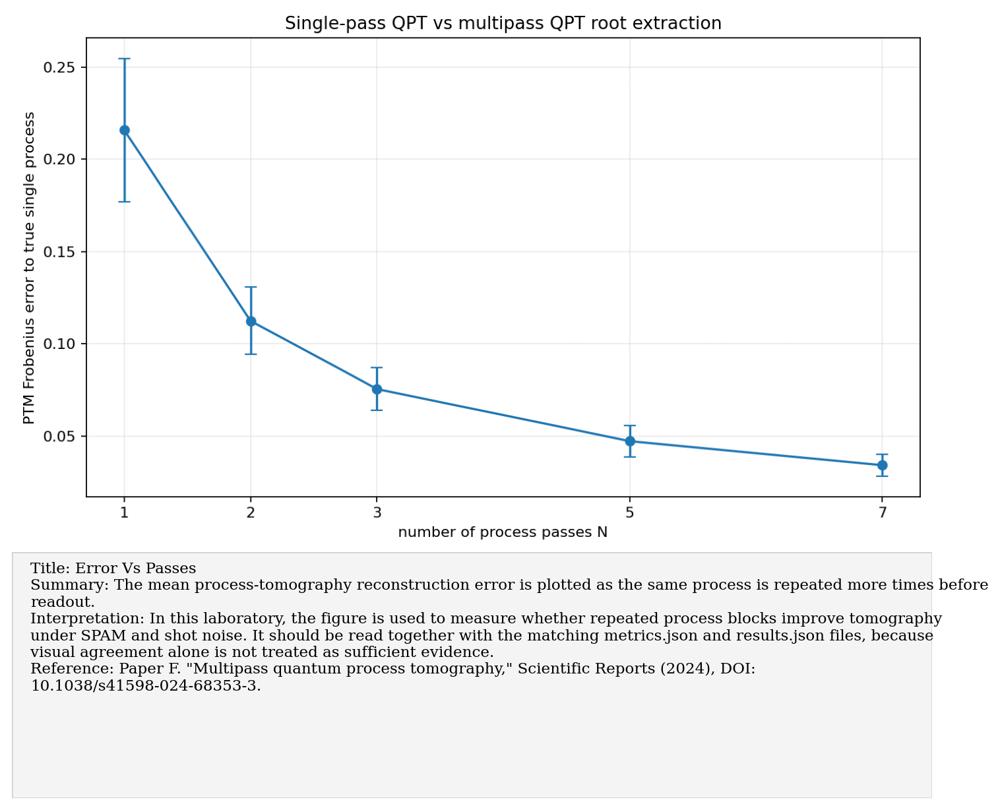
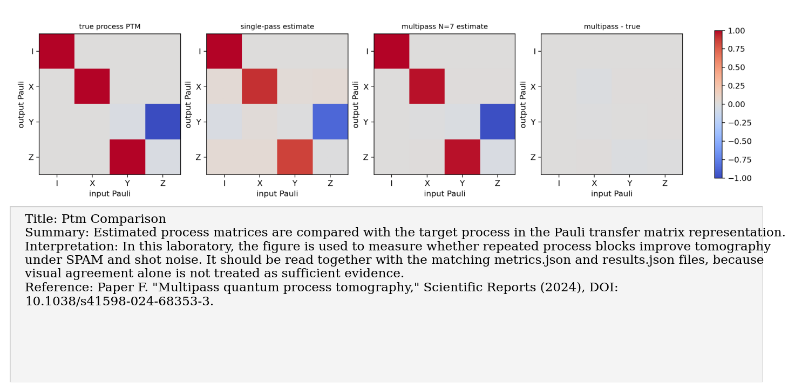
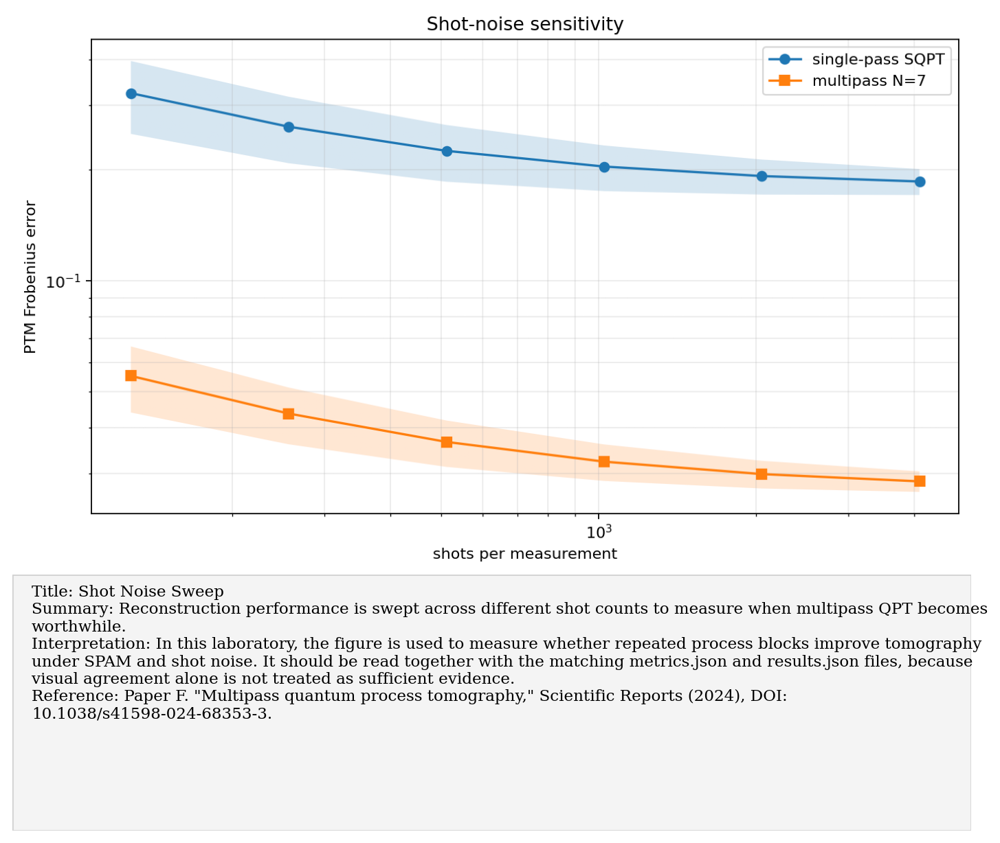
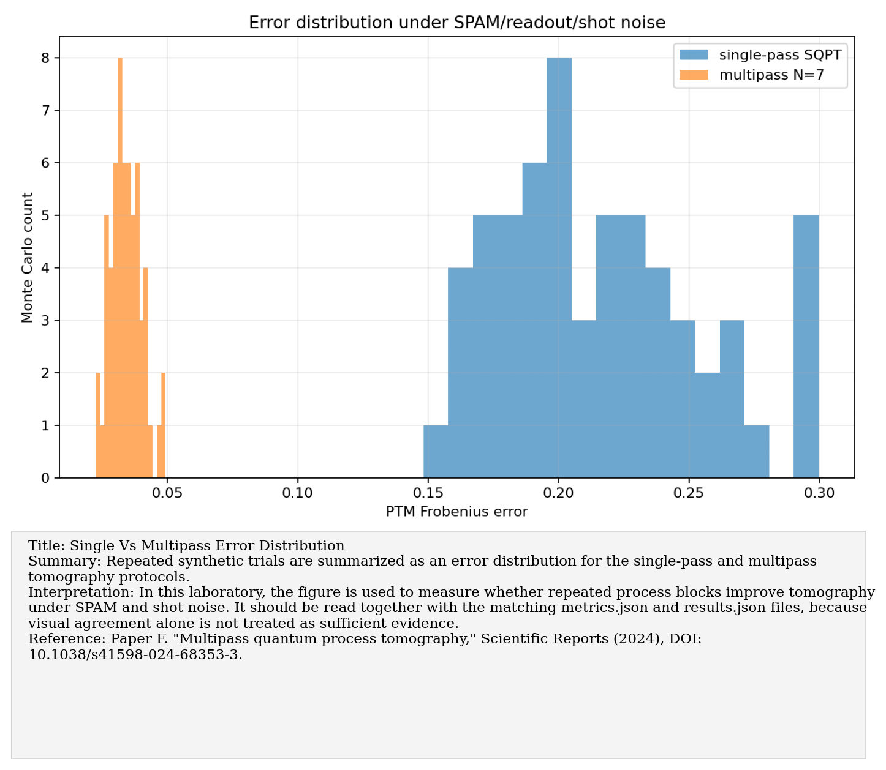

# Paper F: Multipass quantum process tomography

Paper/workflow ID: `multipass_qpt_2024`

Category: `Hardware QPT`

## Primary Reference

Paper F. "Multipass quantum process tomography," Scientific Reports (2024), DOI: 10.1038/s41598-024-68353-3.

## Article Summary

The multipass QPT paper studies process tomography where the same process is applied repeatedly. This can amplify process signatures relative to SPAM and sampling noise, improving characterization in some regimes.

## Scientific Insights

The key insight is experimental design: changing the number of passes changes the information content of the data. Repeated application is not just redundant measurement; it can expose weak process errors.

## Implemented Laboratory Model

Single-qubit PTM reconstruction with single-pass and multipass protocols.

## Direct Laboratory Comparison

Our one-qubit synthetic prototype compared single-pass and multipass PTM reconstruction under synthetic SPAM/readout/shot noise. The best multipass setting substantially reduced the mean reconstruction error.

## Project Lesson

Repeated blocks can amplify weak process signatures and improve reconstruction.

## Next Laboratory Use

For gate-model hardware access, use multipass protocols as an optional amplification layer after basic QPT and GST are working.

## Known Limitations

One-qubit synthetic prototype; not yet tied to a real backend.

## Key Metrics

- `process.ptm_frobenius_error_target_to_actual`: `0.0504287`
- `monte_carlo.shots`: `512`
- `monte_carlo.seed_count`: `60`
- `monte_carlo.single_pass_error.mean`: `0.215744`
- `monte_carlo.single_pass_error.std`: `0.0386803`
- `monte_carlo.single_pass_error.median`: `0.210698`

## Figure Guide

### Figure 1. Error Vs Passes

- Summary: The mean process-tomography reconstruction error is plotted as the same process is repeated more times before readout.
- Interpretation: In this laboratory, the figure is used to measure whether repeated process blocks improve tomography under SPAM and shot noise. It should be read together with the matching metrics.json and results.json files, because visual agreement alone is not treated as sufficient evidence.
- Reference: Paper F. "Multipass quantum process tomography," Scientific Reports (2024), DOI: 10.1038/s41598-024-68353-3.

### Figure 2. Ptm Comparison

- Summary: Estimated process matrices are compared with the target process in the Pauli transfer matrix representation.
- Interpretation: In this laboratory, the figure is used to measure whether repeated process blocks improve tomography under SPAM and shot noise. It should be read together with the matching metrics.json and results.json files, because visual agreement alone is not treated as sufficient evidence.
- Reference: Paper F. "Multipass quantum process tomography," Scientific Reports (2024), DOI: 10.1038/s41598-024-68353-3.

### Figure 3. Shot Noise Sweep

- Summary: Reconstruction performance is swept across different shot counts to measure when multipass QPT becomes worthwhile.
- Interpretation: In this laboratory, the figure is used to measure whether repeated process blocks improve tomography under SPAM and shot noise. It should be read together with the matching metrics.json and results.json files, because visual agreement alone is not treated as sufficient evidence.
- Reference: Paper F. "Multipass quantum process tomography," Scientific Reports (2024), DOI: 10.1038/s41598-024-68353-3.

### Figure 4. Single Vs Multipass Error Distribution

- Summary: Repeated synthetic trials are summarized as an error distribution for the single-pass and multipass tomography protocols.
- Interpretation: In this laboratory, the figure is used to measure whether repeated process blocks improve tomography under SPAM and shot noise. It should be read together with the matching metrics.json and results.json files, because visual agreement alone is not treated as sufficient evidence.
- Reference: Paper F. "Multipass quantum process tomography," Scientific Reports (2024), DOI: 10.1038/s41598-024-68353-3.

## Canonical Artifacts

- Metrics: `outputs/repro/multipass_qpt_2024/latest/metrics.json`
- Config: `outputs/repro/multipass_qpt_2024/latest/config_used.json`
- Results: `outputs/repro/multipass_qpt_2024/latest/results.json`
