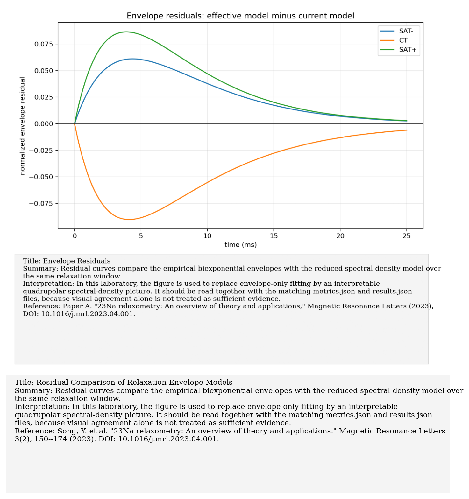
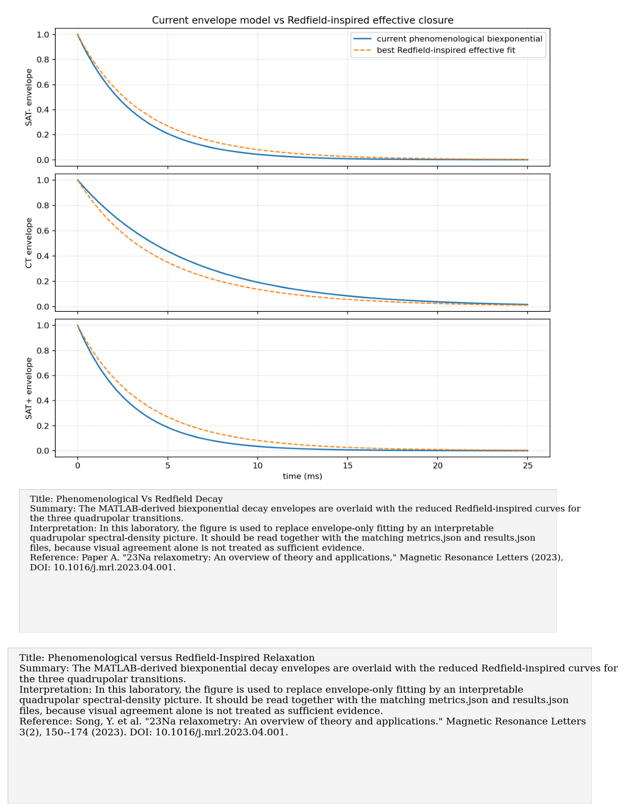
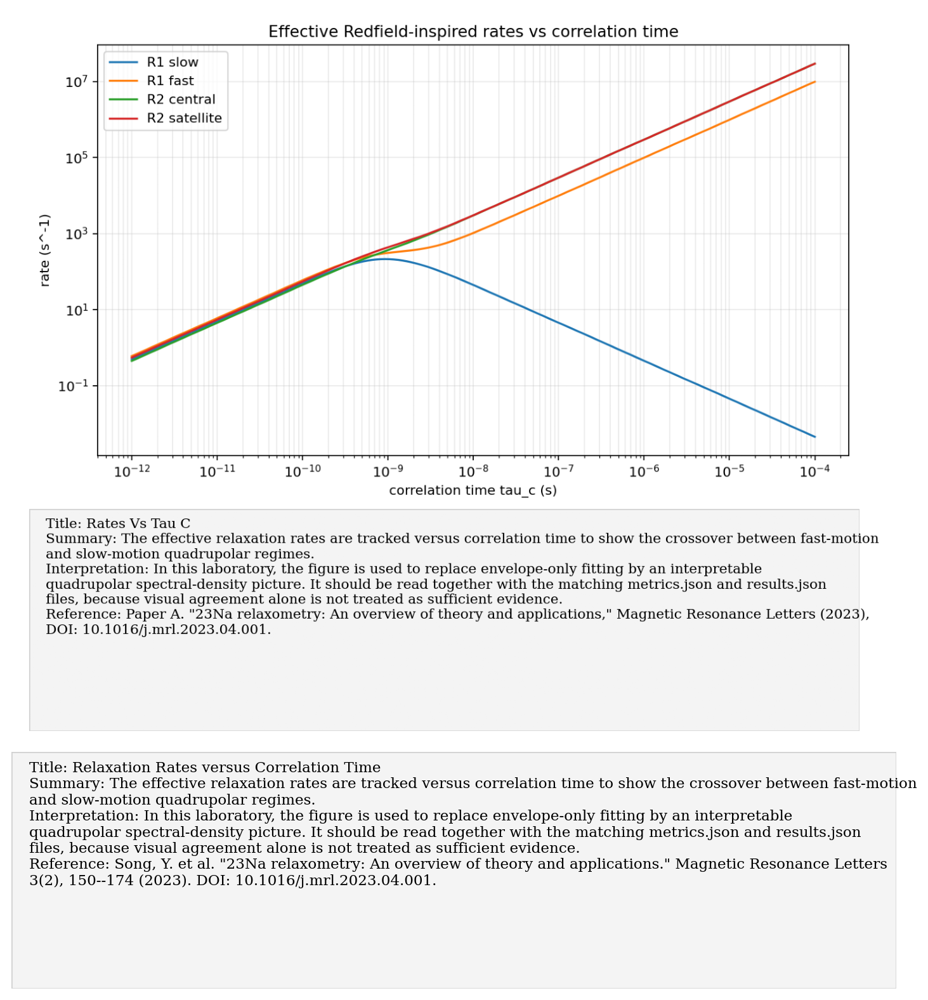
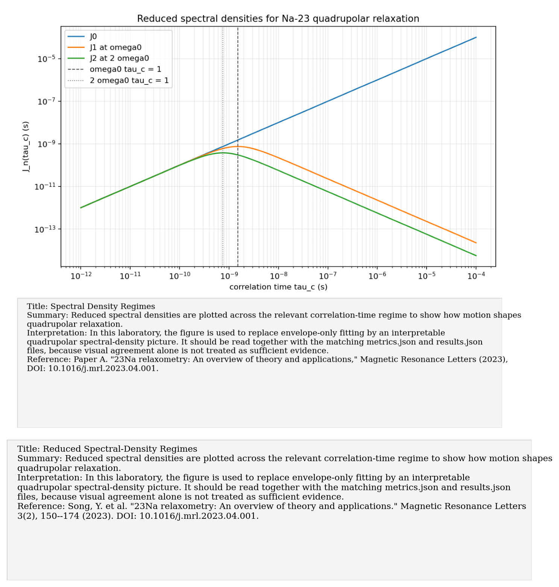

# Paper A: 23Na relaxometry: theory and applications

Paper/workflow ID: `na23_relaxometry_2023`

Category: `Na-23 relaxation`

## Primary Reference

Song, Y. et al. "23Na relaxometry: An overview of theory and applications." Magnetic Resonance Letters 3(2), 150--174 (2023). DOI: 10.1016/j.mrl.2023.04.001.

## Article Summary

The review organizes Na-23 relaxometry around the fact that Na-23 is a spin-3/2 quadrupolar nucleus whose relaxation is strongly shaped by electric-field-gradient fluctuations, correlation times, and spectral densities. It is mainly a conceptual and modeling foundation rather than a single-figure reproduction target.

## Scientific Insights

The important physics is that T1 and T2 are not arbitrary fitting constants: for quadrupolar nuclei they encode environmental motion through spectral densities. A phenomenological biexponential can fit an envelope, but it does not by itself identify a microscopic relaxation mechanism.

## Implemented Laboratory Model

Biexponential envelopes compared with reduced Redfield-inspired spectral-density rates.

## Direct Comparison with the Published Reference

Our lab comparison uses the current biexponential decay model as the empirical baseline and a reduced Redfield-inspired effective model as the interpretable extension. The synthetic fit shows that the empirical model can be matched qualitatively, but the interpretation should remain cautious until T1/T2 or tomography data arrive.

## Interpretation for the Present Study

The current empirical decay model is useful, but interpretable relaxometry needs spectral-density parameters.

## Experimental Implication

Use this paper to define the language for the first real relaxation campaign: T1, T2, correlation time, quadrupolar coupling, spectral density, and regime of motion.

## Current Deviations from the Published Reference

Qualitative effective-model reproduction of a review paper, not a full clinical or materials review.

## Key Metrics

- `best_fit.global_envelope_rmse`: `0.0445693`

## Figure Guide

### Figure 1. Residual Comparison of Relaxation-Envelope Models

- Summary: Residual curves compare the empirical biexponential envelopes with the reduced spectral-density model over the same relaxation window.
- Interpretation: In this laboratory, the figure is used to replace envelope-only fitting by an interpretable quadrupolar spectral-density picture. It should be read together with the matching metrics.json and results.json files, because visual agreement alone is not treated as sufficient evidence.
- Reference: Song, Y. et al. "23Na relaxometry: An overview of theory and applications." Magnetic Resonance Letters 3(2), 150--174 (2023). DOI: 10.1016/j.mrl.2023.04.001.

### Figure 2. Phenomenological versus Redfield-Inspired Relaxation

- Summary: The MATLAB-derived biexponential decay envelopes are overlaid with the reduced Redfield-inspired curves for the three quadrupolar transitions.
- Interpretation: In this laboratory, the figure is used to replace envelope-only fitting by an interpretable quadrupolar spectral-density picture. It should be read together with the matching metrics.json and results.json files, because visual agreement alone is not treated as sufficient evidence.
- Reference: Song, Y. et al. "23Na relaxometry: An overview of theory and applications." Magnetic Resonance Letters 3(2), 150--174 (2023). DOI: 10.1016/j.mrl.2023.04.001.

### Figure 3. Relaxation Rates versus Correlation Time

- Summary: The effective relaxation rates are tracked versus correlation time to show the crossover between fast-motion and slow-motion quadrupolar regimes.
- Interpretation: In this laboratory, the figure is used to replace envelope-only fitting by an interpretable quadrupolar spectral-density picture. It should be read together with the matching metrics.json and results.json files, because visual agreement alone is not treated as sufficient evidence.
- Reference: Song, Y. et al. "23Na relaxometry: An overview of theory and applications." Magnetic Resonance Letters 3(2), 150--174 (2023). DOI: 10.1016/j.mrl.2023.04.001.

### Figure 4. Reduced Spectral-Density Regimes

- Summary: Reduced spectral densities are plotted across the relevant correlation-time regime to show how motion shapes quadrupolar relaxation.
- Interpretation: In this laboratory, the figure is used to replace envelope-only fitting by an interpretable quadrupolar spectral-density picture. It should be read together with the matching metrics.json and results.json files, because visual agreement alone is not treated as sufficient evidence.
- Reference: Song, Y. et al. "23Na relaxometry: An overview of theory and applications." Magnetic Resonance Letters 3(2), 150--174 (2023). DOI: 10.1016/j.mrl.2023.04.001.

## Canonical Artifacts

- Metrics: `outputs/repro/na23_relaxometry_2023/latest/metrics.json`
- Config: `outputs/repro/na23_relaxometry_2023/latest/config_used.json`
- Results: `outputs/repro/na23_relaxometry_2023/latest/results.json`
