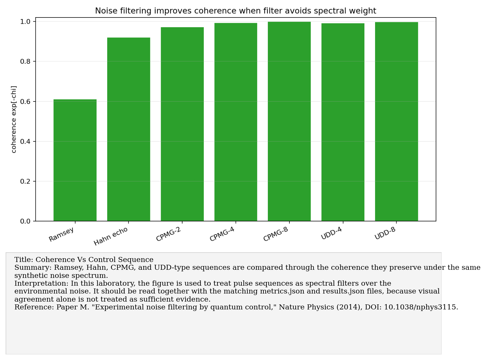
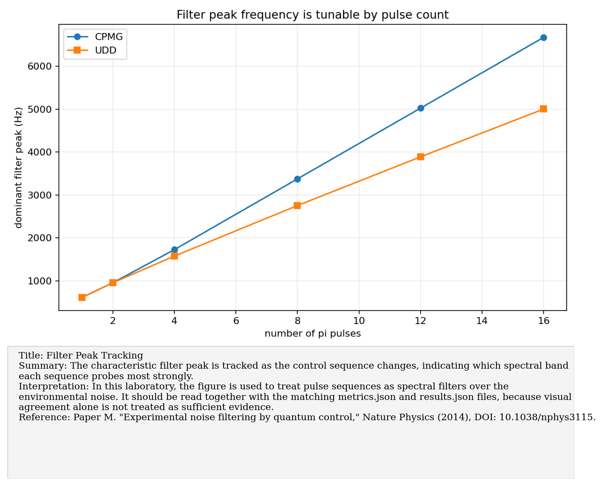
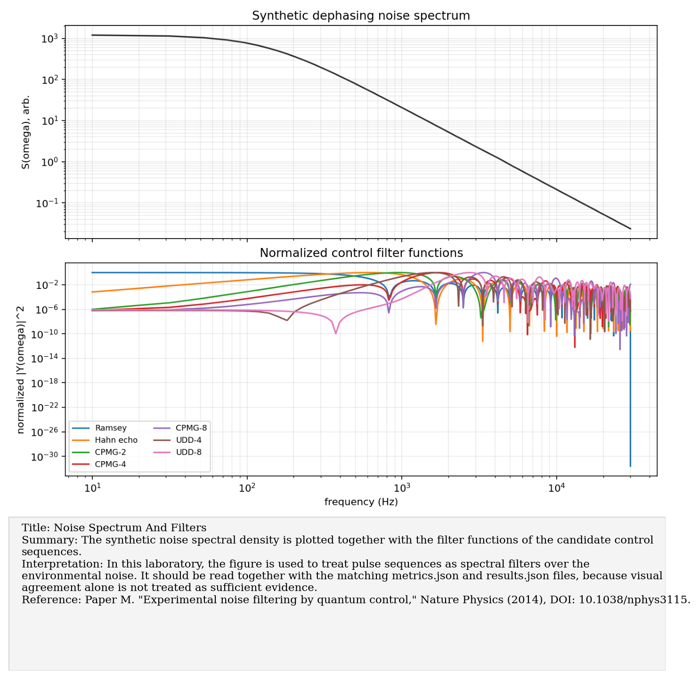
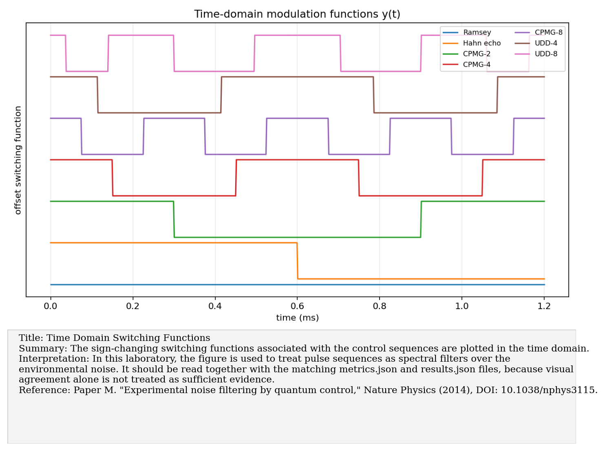

# Paper M: Experimental noise filtering by quantum control

Paper/workflow ID: `noise_filtering_control_2014`

Category: `DD filtering`

## Primary Reference

Paper M. "Experimental noise filtering by quantum control," Nature Physics (2014), DOI: 10.1038/nphys3115.

## Article Summary

This paper treats quantum control as noise filtering. Pulse sequences such as Ramsey, Hahn, CPMG, and UDD shape the spectral response of the qubit or spin to environmental noise.

## Scientific Insights

The key insight is spectral selectivity. Control sequences are filters in frequency space, so preserving coherence means aligning the filter with low-noise regions or rejecting dominant noise bands.

## Implemented Laboratory Model

Ramsey, Hahn, CPMG, and UDD filter functions under synthetic dephasing spectra.

## Direct Laboratory Comparison

Our benchmark computed filter functions and coherences under synthetic noise. It showed strong coherence gain from DD relative to Ramsey, establishing the basis for spectroscopy and control selection.

## Project Lesson

Control can suppress noise by shifting filter sensitivity away from dominant spectral weight.

## Next Laboratory Use

Use filter-function plots to choose initial DD sequences before attempting full noise-spectrum inversion.

## Known Limitations

Ideal instantaneous pulses; finite-pulse errors must be added before lab claims.

## Key Metrics

- `simulation.total_time_s`: `0.0012`
- `simulation.frequency_min_hz`: `10`
- `simulation.frequency_max_hz`: `3.0000e+04`
- `simulation.sequence_count`: `7`
- `summary.ramsey_coherence`: `0.609315`
- `summary.best_coherence`: `0.998123`

## Figure Guide

### Figure 1. Coherence Vs Control Sequence

- Summary: Ramsey, Hahn, CPMG, and UDD-type sequences are compared through the coherence they preserve under the same synthetic noise spectrum.
- Interpretation: In this laboratory, the figure is used to treat pulse sequences as spectral filters over the environmental noise. It should be read together with the matching metrics.json and results.json files, because visual agreement alone is not treated as sufficient evidence.
- Reference: Paper M. "Experimental noise filtering by quantum control," Nature Physics (2014), DOI: 10.1038/nphys3115.

### Figure 2. Filter Peak Tracking

- Summary: The characteristic filter peak is tracked as the control sequence changes, indicating which spectral band each sequence probes most strongly.
- Interpretation: In this laboratory, the figure is used to treat pulse sequences as spectral filters over the environmental noise. It should be read together with the matching metrics.json and results.json files, because visual agreement alone is not treated as sufficient evidence.
- Reference: Paper M. "Experimental noise filtering by quantum control," Nature Physics (2014), DOI: 10.1038/nphys3115.

### Figure 3. Noise Spectrum And Filters

- Summary: The synthetic noise spectral density is plotted together with the filter functions of the candidate control sequences.
- Interpretation: In this laboratory, the figure is used to treat pulse sequences as spectral filters over the environmental noise. It should be read together with the matching metrics.json and results.json files, because visual agreement alone is not treated as sufficient evidence.
- Reference: Paper M. "Experimental noise filtering by quantum control," Nature Physics (2014), DOI: 10.1038/nphys3115.

### Figure 4. Time Domain Switching Functions

- Summary: The sign-changing switching functions associated with the control sequences are plotted in the time domain.
- Interpretation: In this laboratory, the figure is used to treat pulse sequences as spectral filters over the environmental noise. It should be read together with the matching metrics.json and results.json files, because visual agreement alone is not treated as sufficient evidence.
- Reference: Paper M. "Experimental noise filtering by quantum control," Nature Physics (2014), DOI: 10.1038/nphys3115.

## Canonical Artifacts

- Metrics: `outputs/repro/noise_filtering_control_2014/latest/metrics.json`
- Config: `outputs/repro/noise_filtering_control_2014/latest/config_used.json`
- Results: `outputs/repro/noise_filtering_control_2014/latest/results.json`
