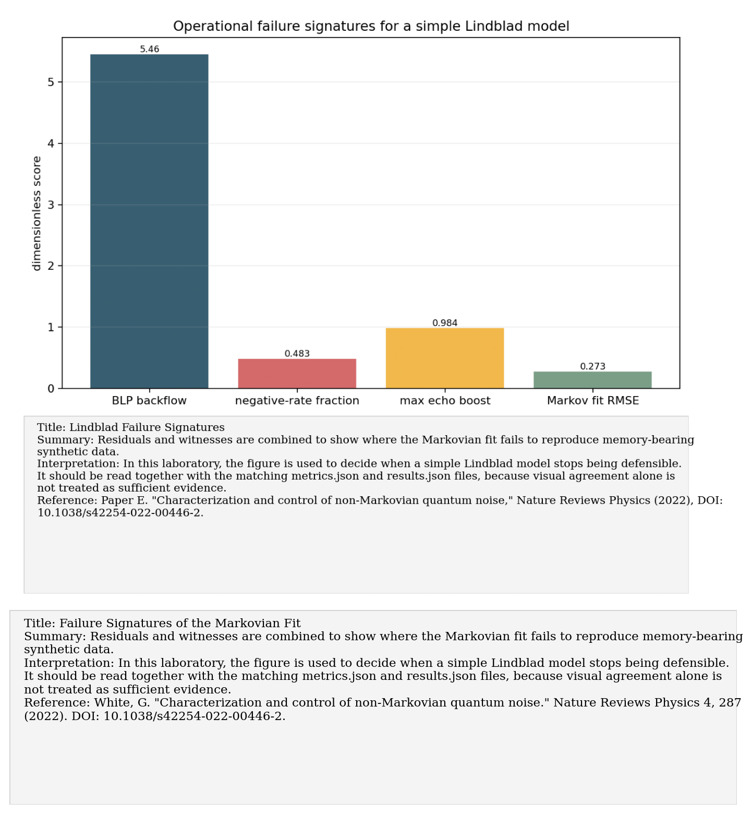
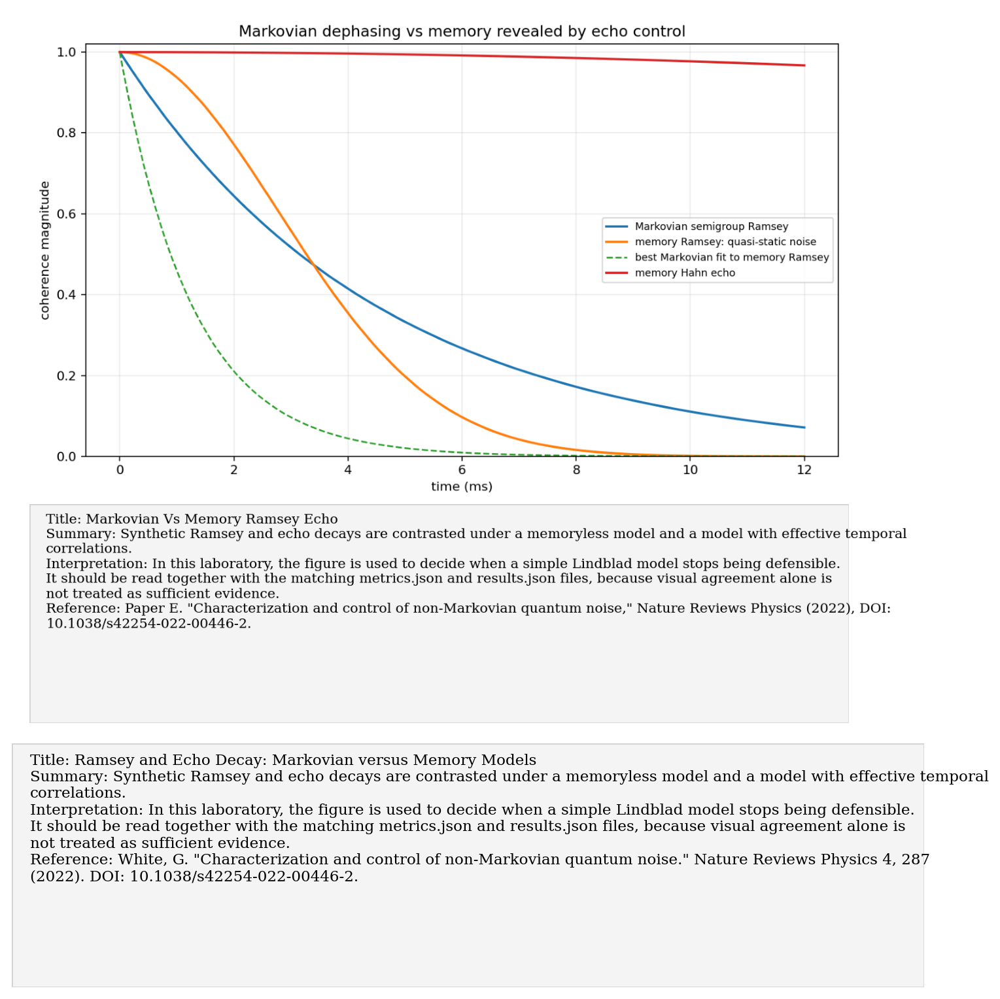
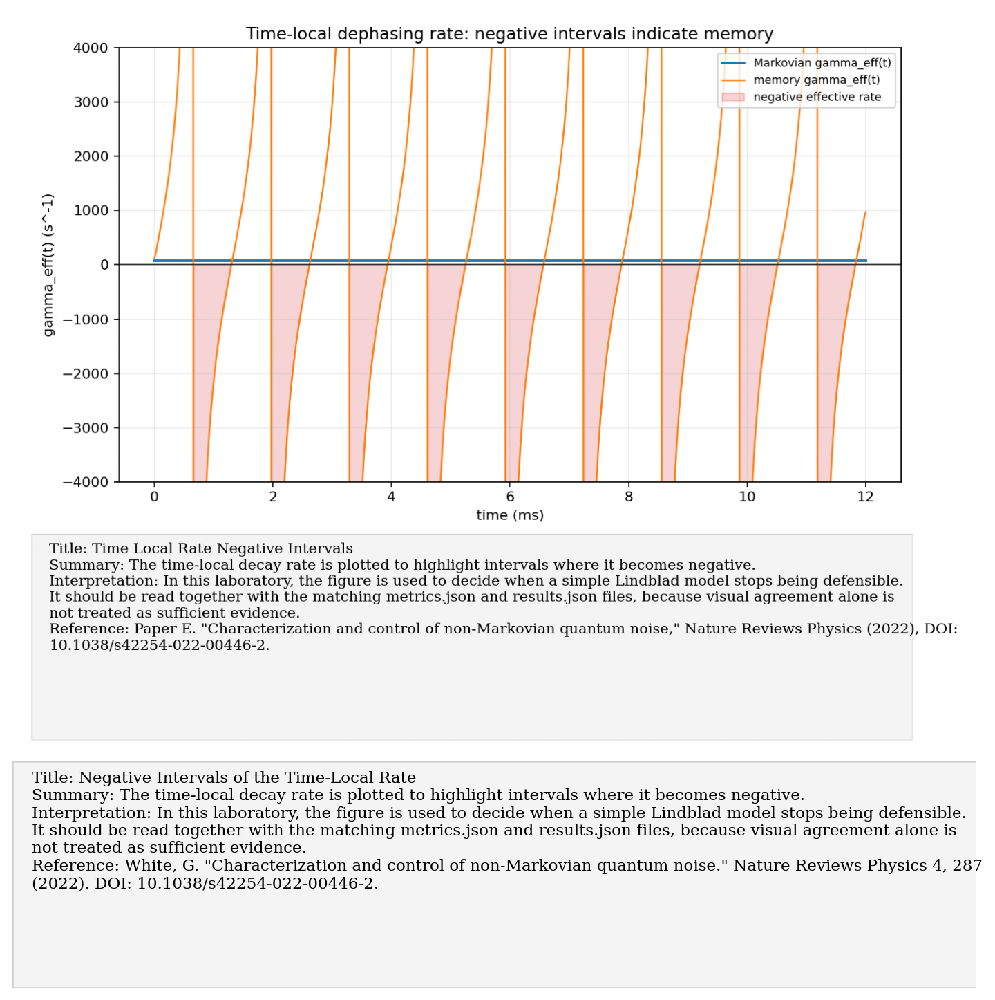
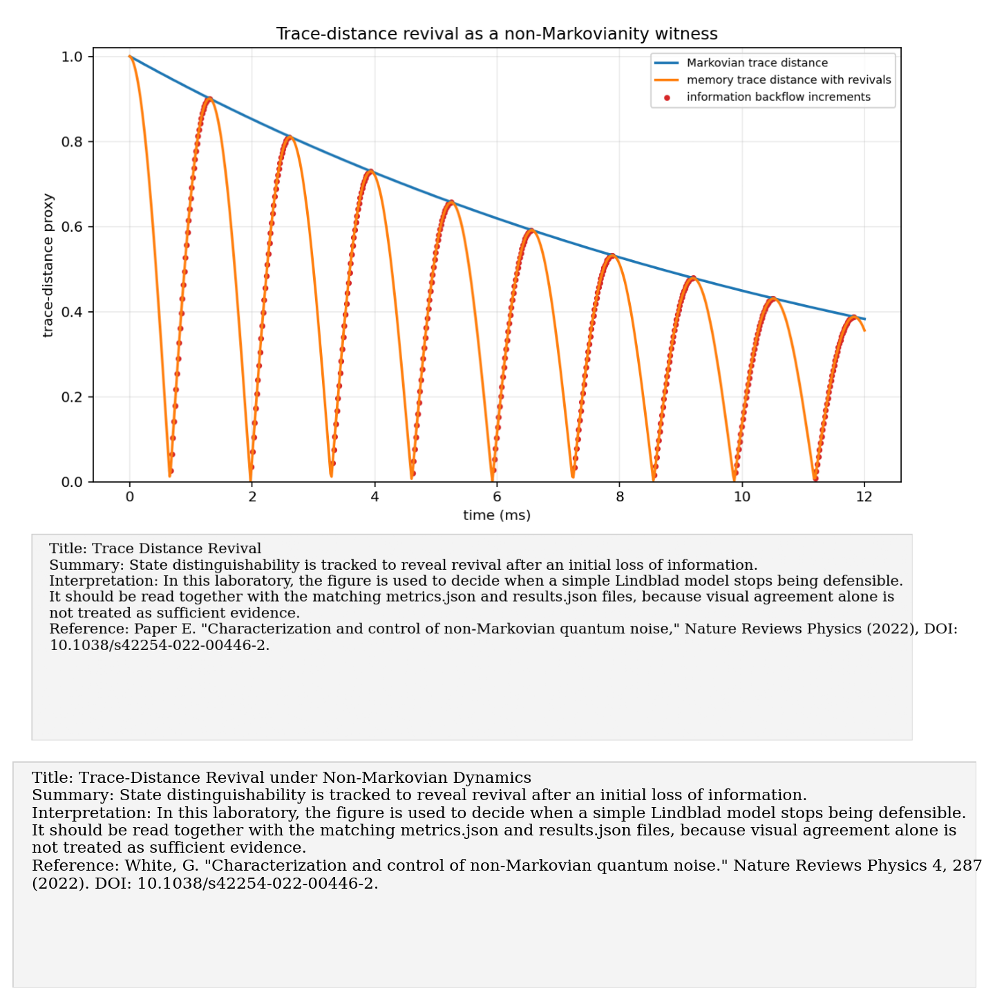

# Paper E: Characterization and control of non-Markovian quantum noise

Paper/workflow ID: `nonmarkov_noise_2022`

Category: `Memory diagnostics`

## Primary Reference

White, G. "Characterization and control of non-Markovian quantum noise." Nature Reviews Physics 4, 287 (2022). DOI: 10.1038/s42254-022-00446-2.

## Article Summary

The non-Markovian noise review frames the difference between memoryless effective dynamics and history-dependent dynamics. It motivates diagnostics such as trace-distance revivals, information backflow, negative time-local rates, and process-tensor approaches.

## Scientific Insights

The central insight is that a Lindblad equation is a model class, not a universal truth. Echo recovery, temporal correlations, or failure to predict multi-time data can reveal memory even when single-time decays look simple.

## Implemented Laboratory Model

Trace-distance revivals, negative time-local rates, Ramsey/echo disagreement, Markovian fit residuals.

## Direct Comparison with the Published Reference

Our synthetic benchmark created a memory-effective case and compared it against a Markovian fit. The Markovian model produced large residuals and failed echo predictions, giving concrete failure signatures for the lab.

## Interpretation for the Present Study

A Lindblad model is sufficient only while it predicts the measured history-dependent data.

## Experimental Implication

If repeated FIDs, echo experiments, or tomography trajectories show revival or history dependence, escalate from simple Lindblad fitting to memory models or process tensors.

## Current Deviations from the Published Reference

Benchmark is synthetic and minimal, not a reproduction of the full review.

## Key Metrics

- `failure_metrics.blp_measure`: `5.45706`
- `failure_metrics.markovian_fit_rmse`: `0.273341`

## Figure Guide

### Figure 1. Failure Signatures of the Markovian Fit

- Summary: Residuals and witnesses are combined to show where the Markovian fit fails to reproduce memory-bearing synthetic data.
- Interpretation: In this laboratory, the figure is used to decide when a simple Lindblad model stops being defensible. It should be read together with the matching metrics.json and results.json files, because visual agreement alone is not treated as sufficient evidence.
- Reference: White, G. "Characterization and control of non-Markovian quantum noise." Nature Reviews Physics 4, 287 (2022). DOI: 10.1038/s42254-022-00446-2.

### Figure 2. Ramsey and Echo Decay: Markovian versus Memory Models

- Summary: Synthetic Ramsey and echo decays are contrasted under a memoryless model and a model with effective temporal correlations.
- Interpretation: In this laboratory, the figure is used to decide when a simple Lindblad model stops being defensible. It should be read together with the matching metrics.json and results.json files, because visual agreement alone is not treated as sufficient evidence.
- Reference: White, G. "Characterization and control of non-Markovian quantum noise." Nature Reviews Physics 4, 287 (2022). DOI: 10.1038/s42254-022-00446-2.

### Figure 3. Negative Intervals of the Time-Local Rate

- Summary: The time-local decay rate is plotted to highlight intervals where it becomes negative.
- Interpretation: In this laboratory, the figure is used to decide when a simple Lindblad model stops being defensible. It should be read together with the matching metrics.json and results.json files, because visual agreement alone is not treated as sufficient evidence.
- Reference: White, G. "Characterization and control of non-Markovian quantum noise." Nature Reviews Physics 4, 287 (2022). DOI: 10.1038/s42254-022-00446-2.

### Figure 4. Trace-Distance Revival under Non-Markovian Dynamics

- Summary: State distinguishability is tracked to reveal revival after an initial loss of information.
- Interpretation: In this laboratory, the figure is used to decide when a simple Lindblad model stops being defensible. It should be read together with the matching metrics.json and results.json files, because visual agreement alone is not treated as sufficient evidence.
- Reference: White, G. "Characterization and control of non-Markovian quantum noise." Nature Reviews Physics 4, 287 (2022). DOI: 10.1038/s42254-022-00446-2.

## Canonical Artifacts

- Metrics: `outputs/repro/nonmarkov_noise_2022/latest/metrics.json`
- Config: `outputs/repro/nonmarkov_noise_2022/latest/config_used.json`
- Results: `outputs/repro/nonmarkov_noise_2022/latest/results.json`
