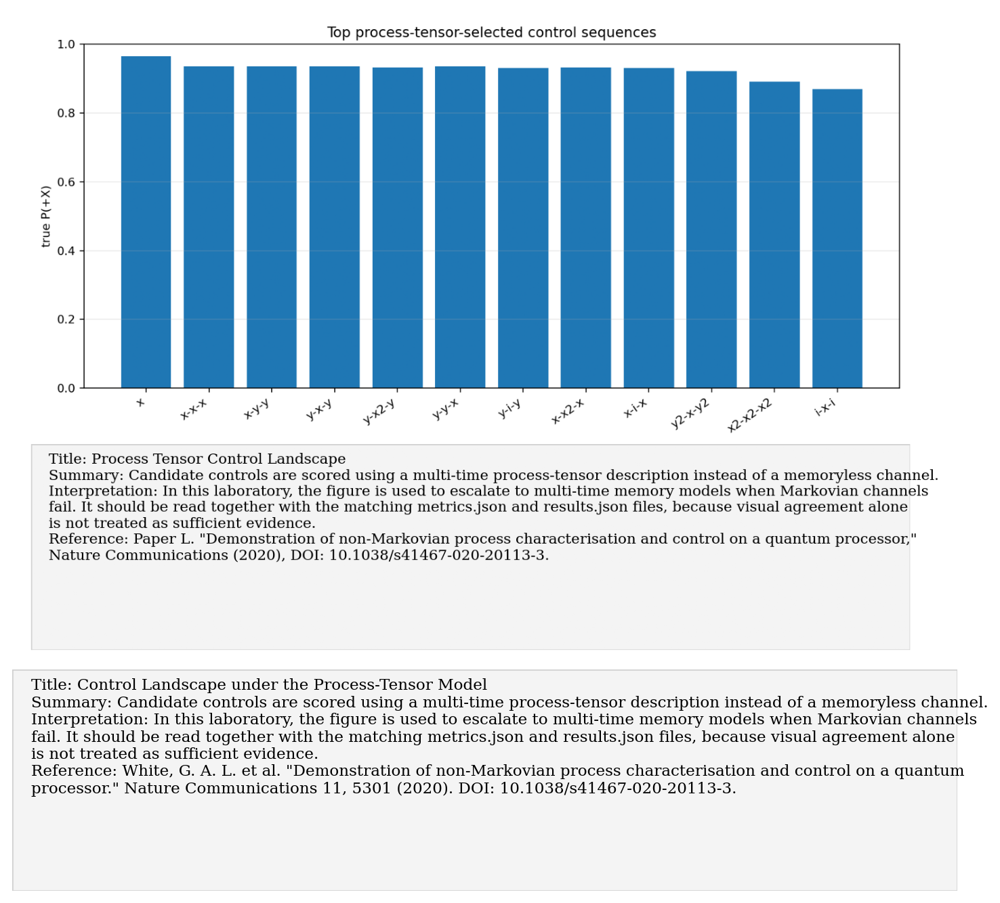
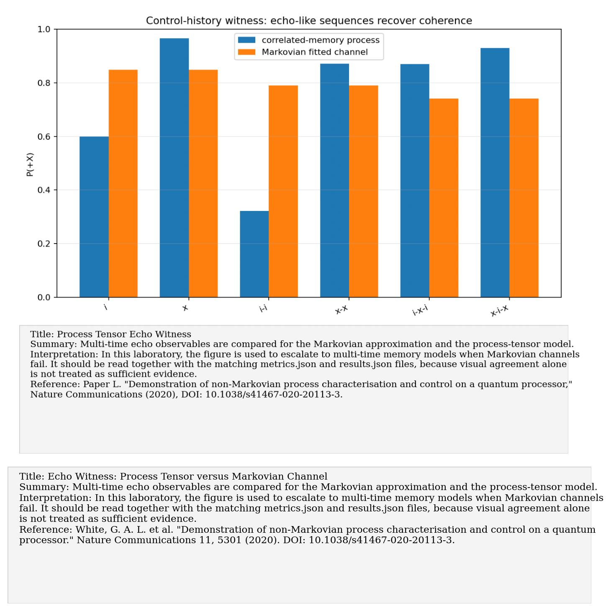
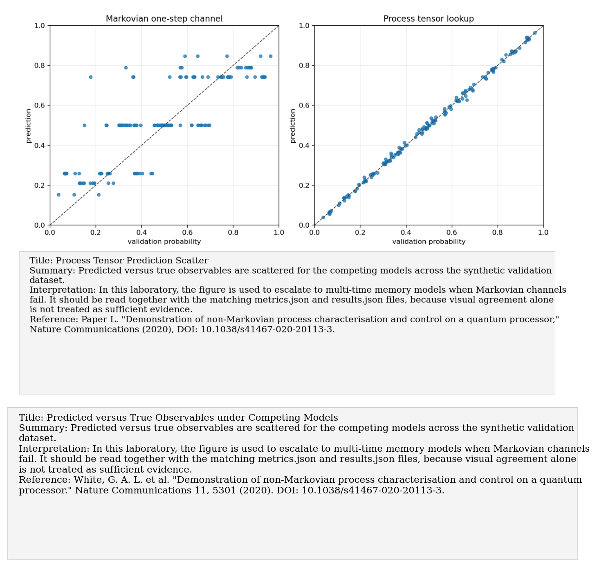
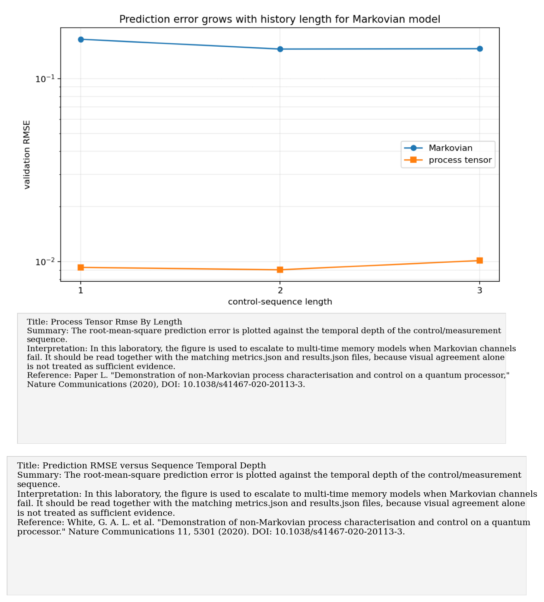

# Paper L: Non-Markovian process tensor characterization and control

Paper/workflow ID: `nonmarkov_process_tensor_2020`

Category: `Multi-time memory`

## Primary Reference

White, G. A. L. et al. "Demonstration of non-Markovian process characterisation and control on a quantum processor." Nature Communications 11, 5301 (2020). DOI: 10.1038/s41467-020-20113-3.

## Article Summary

The process-tensor paper demonstrates multi-time characterization and control in non-Markovian settings. Rather than describing a process by one fixed channel, it models how interventions at different times interact with memory.

## Scientific Insights

The central insight is that memory is operational: the best next control can depend on the previous controls. A single Markovian channel cannot represent that dependence.

## Implemented Laboratory Model

Synthetic process tensor versus Markovian channel for multi-time prediction and control selection.

## Direct Comparison with the Published Reference

Our synthetic process-tensor benchmark predicted multi-time probabilities far better than a fixed Markovian model and selected a different, better control sequence.

## Interpretation for the Present Study

Memory-aware prediction can select different and better controls than Markovian modeling.

## Experimental Implication

Escalate to process-tensor experiments only after simpler DD, QST, and Lindblad models fail; it is powerful but experimentally expensive.

## Current Deviations from the Published Reference

Synthetic correlated dephasing only; real process-tensor tomography is experimentally expensive.

## Key Metrics

- `prediction_summary.improvement_factor`: `14.7084`
- `control_summary.true_control_advantage`: `0.365222`

## Figure Guide

### Figure 1. Control Landscape under the Process-Tensor Model

- Summary: Candidate controls are scored using a multi-time process-tensor description instead of a memoryless channel.
- Interpretation: In this laboratory, the figure is used to escalate to multi-time memory models when Markovian channels fail. It should be read together with the matching metrics.json and results.json files, because visual agreement alone is not treated as sufficient evidence.
- Reference: White, G. A. L. et al. "Demonstration of non-Markovian process characterisation and control on a quantum processor." Nature Communications 11, 5301 (2020). DOI: 10.1038/s41467-020-20113-3.

### Figure 2. Echo Witness: Process Tensor versus Markovian Channel

- Summary: Multi-time echo observables are compared for the Markovian approximation and the process-tensor model.
- Interpretation: In this laboratory, the figure is used to escalate to multi-time memory models when Markovian channels fail. It should be read together with the matching metrics.json and results.json files, because visual agreement alone is not treated as sufficient evidence.
- Reference: White, G. A. L. et al. "Demonstration of non-Markovian process characterisation and control on a quantum processor." Nature Communications 11, 5301 (2020). DOI: 10.1038/s41467-020-20113-3.

### Figure 3. Predicted versus True Observables under Competing Models

- Summary: Predicted versus true observables are scattered for the competing models across the synthetic validation dataset.
- Interpretation: In this laboratory, the figure is used to escalate to multi-time memory models when Markovian channels fail. It should be read together with the matching metrics.json and results.json files, because visual agreement alone is not treated as sufficient evidence.
- Reference: White, G. A. L. et al. "Demonstration of non-Markovian process characterisation and control on a quantum processor." Nature Communications 11, 5301 (2020). DOI: 10.1038/s41467-020-20113-3.

### Figure 4. Prediction RMSE versus Sequence Temporal Depth

- Summary: The root-mean-square prediction error is plotted against the temporal depth of the control/measurement sequence.
- Interpretation: In this laboratory, the figure is used to escalate to multi-time memory models when Markovian channels fail. It should be read together with the matching metrics.json and results.json files, because visual agreement alone is not treated as sufficient evidence.
- Reference: White, G. A. L. et al. "Demonstration of non-Markovian process characterisation and control on a quantum processor." Nature Communications 11, 5301 (2020). DOI: 10.1038/s41467-020-20113-3.

## Canonical Artifacts

- Metrics: `outputs/repro/nonmarkov_process_tensor_2020/latest/metrics.json`
- Config: `outputs/repro/nonmarkov_process_tensor_2020/latest/config_used.json`
- Results: `outputs/repro/nonmarkov_process_tensor_2020/latest/results.json`
