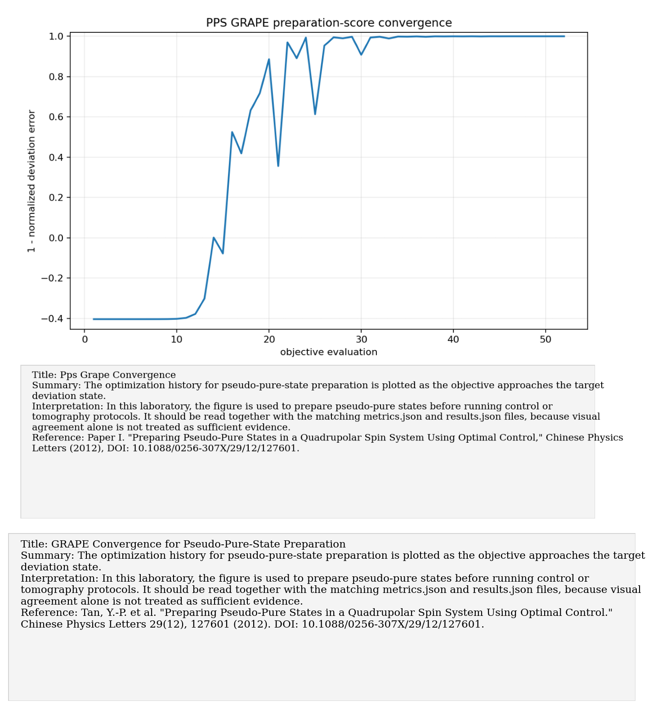
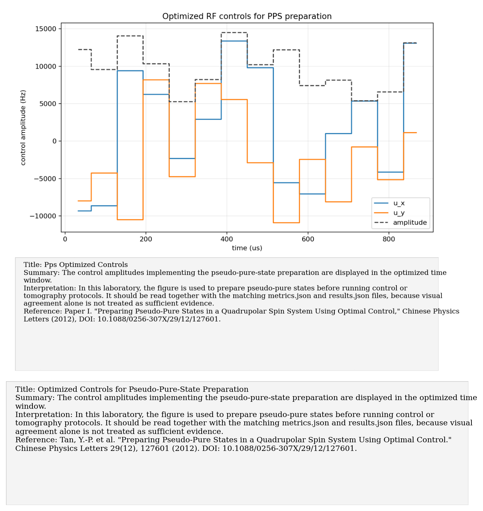
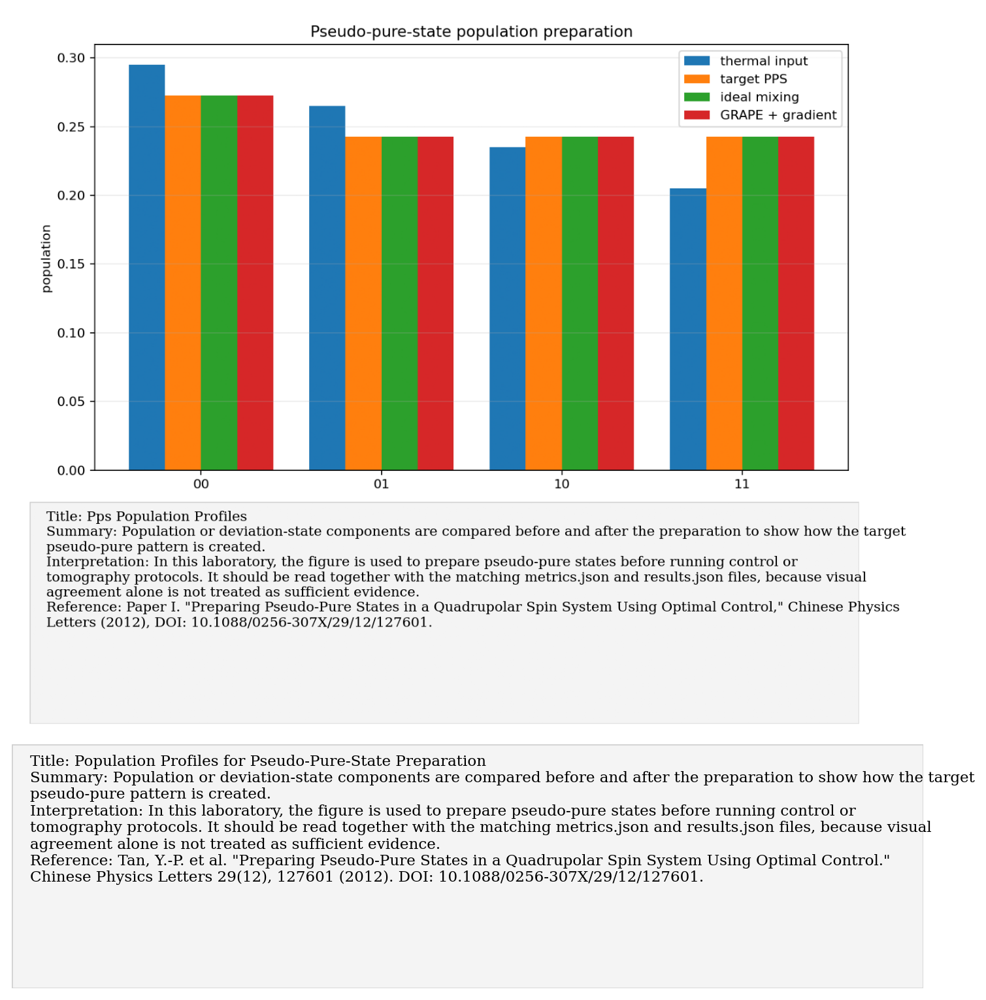
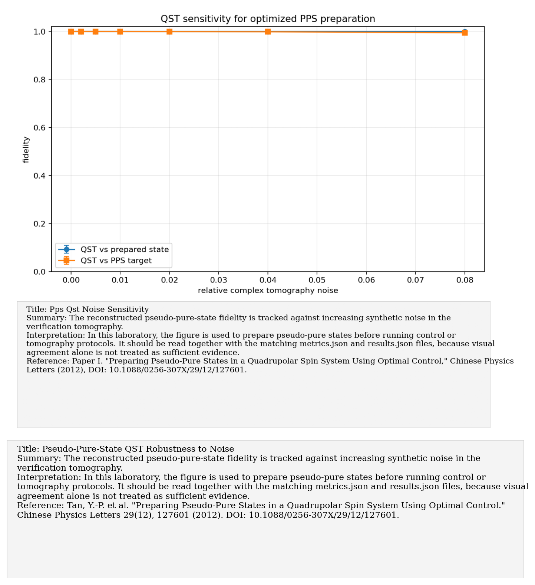

# Paper I: Pseudo-pure states in a quadrupolar spin system

Paper/workflow ID: `pps_optimal_control_2012`

Category: `State preparation`

## Primary Reference

Tan, Y.-P. et al. "Preparing Pseudo-Pure States in a Quadrupolar Spin System Using Optimal Control." Chinese Physics Letters 29(12), 127601 (2012). DOI: 10.1088/0256-307X/29/12/127601.

## Article Summary

This paper focuses on preparing pseudo-pure states in a quadrupolar spin system using optimal control. Pseudo-pure states are necessary because room-temperature NMR begins near a highly mixed thermal state with a small deviation component.

## Scientific Insights

The insight is that useful NMR quantum-information experiments operate on the deviation density matrix. State preparation is therefore about engineering the observable deviation component, not producing a truly pure thermodynamic state.

## Implemented Laboratory Model

Population averaging, GRAPE state preparation, gradient/dephasing step, QST validation.

## Direct Comparison with the Published Reference

Our implementation compared analytical population averaging and GRAPE-based preparation, followed by synthetic QST validation. Both reached near-perfect synthetic deviation fidelity under the modeled assumptions.

## Interpretation for the Present Study

The lab has a reproducible state-preparation layer before control or tomography experiments.

## Experimental Implication

Use this layer before any encoded algorithm or control experiment: prepare the target pseudo-pure state, apply gradient/dephasing if needed, then validate by QST.

## Current Deviations from the Published Reference

Synthetic preparation; real experiments need gradient, RF, and phase calibration.

## Key Metrics

- `grape_preparation.final_preparation_error`: `3.0698e-09`
- `grape_preparation.final_deviation_fidelity`: `1`

## Figure Guide

### Figure 1. GRAPE Convergence for Pseudo-Pure-State Preparation

- Summary: The optimization history for pseudo-pure-state preparation is plotted as the objective approaches the target deviation state.
- Interpretation: In this laboratory, the figure is used to prepare pseudo-pure states before running control or tomography protocols. It should be read together with the matching metrics.json and results.json files, because visual agreement alone is not treated as sufficient evidence.
- Reference: Tan, Y.-P. et al. "Preparing Pseudo-Pure States in a Quadrupolar Spin System Using Optimal Control." Chinese Physics Letters 29(12), 127601 (2012). DOI: 10.1088/0256-307X/29/12/127601.

### Figure 2. Optimized Controls for Pseudo-Pure-State Preparation

- Summary: The control amplitudes implementing the pseudo-pure-state preparation are displayed in the optimized time window.
- Interpretation: In this laboratory, the figure is used to prepare pseudo-pure states before running control or tomography protocols. It should be read together with the matching metrics.json and results.json files, because visual agreement alone is not treated as sufficient evidence.
- Reference: Tan, Y.-P. et al. "Preparing Pseudo-Pure States in a Quadrupolar Spin System Using Optimal Control." Chinese Physics Letters 29(12), 127601 (2012). DOI: 10.1088/0256-307X/29/12/127601.

### Figure 3. Population Profiles for Pseudo-Pure-State Preparation

- Summary: Population or deviation-state components are compared before and after the preparation to show how the target pseudo-pure pattern is created.
- Interpretation: In this laboratory, the figure is used to prepare pseudo-pure states before running control or tomography protocols. It should be read together with the matching metrics.json and results.json files, because visual agreement alone is not treated as sufficient evidence.
- Reference: Tan, Y.-P. et al. "Preparing Pseudo-Pure States in a Quadrupolar Spin System Using Optimal Control." Chinese Physics Letters 29(12), 127601 (2012). DOI: 10.1088/0256-307X/29/12/127601.

### Figure 4. Pseudo-Pure-State QST Robustness to Noise

- Summary: The reconstructed pseudo-pure-state fidelity is tracked against increasing synthetic noise in the verification tomography.
- Interpretation: In this laboratory, the figure is used to prepare pseudo-pure states before running control or tomography protocols. It should be read together with the matching metrics.json and results.json files, because visual agreement alone is not treated as sufficient evidence.
- Reference: Tan, Y.-P. et al. "Preparing Pseudo-Pure States in a Quadrupolar Spin System Using Optimal Control." Chinese Physics Letters 29(12), 127601 (2012). DOI: 10.1088/0256-307X/29/12/127601.

## Canonical Artifacts

- Metrics: `outputs/repro/pps_optimal_control_2012/latest/metrics.json`
- Config: `outputs/repro/pps_optimal_control_2012/latest/config_used.json`
- Results: `outputs/repro/pps_optimal_control_2012/latest/results.json`
