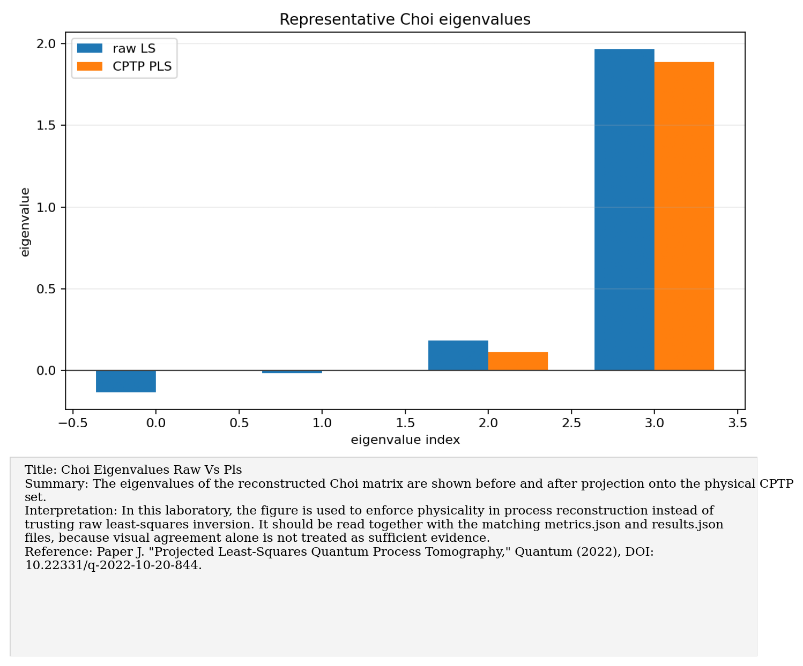
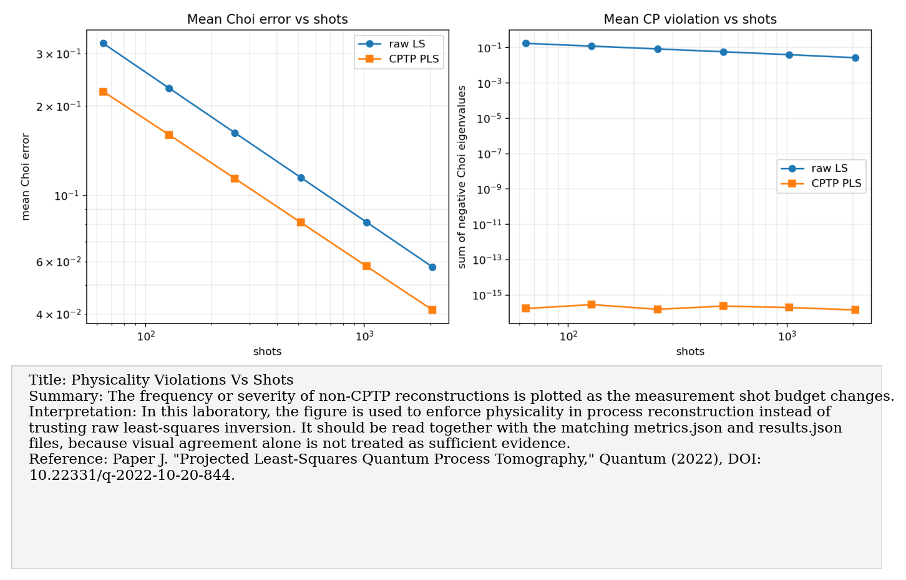
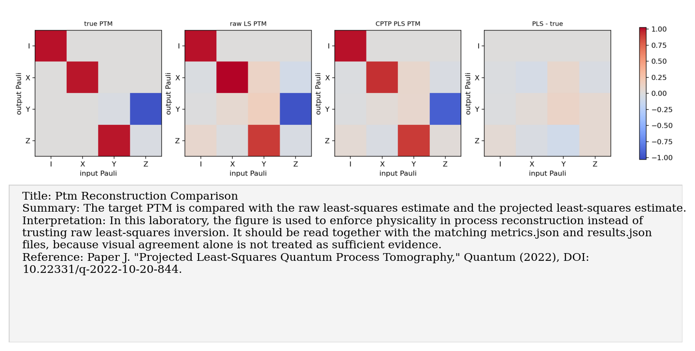
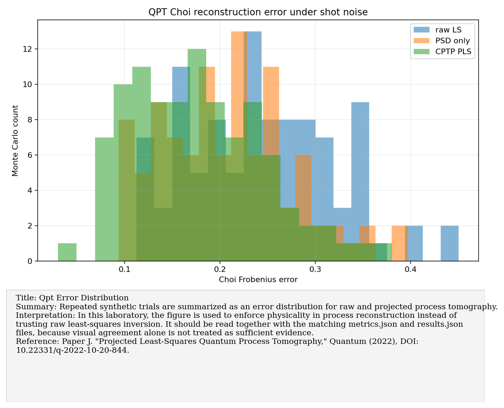

# Paper J: Projected least-squares QPT

Paper/workflow ID: `projected_ls_qpt_2022`

Category: `Physical QPT`

## Primary Reference

Paper J. "Projected Least-Squares Quantum Process Tomography," Quantum (2022), DOI: 10.22331/q-2022-10-20-844.

## Article Summary

Projected least-squares QPT addresses the fact that raw process estimates from finite data can be non-physical. It projects estimates onto physically meaningful sets such as positive semidefinite and trace-preserving Choi matrices.

## Scientific Insights

The central insight is that physical constraints are not cosmetic. Enforcing complete positivity and trace preservation can reduce error and prevent impossible conclusions.

## Implemented Laboratory Model

Raw Choi least squares compared with PSD and CPTP projections.

## Direct Laboratory Comparison

Our synthetic benchmark showed raw Choi estimates with frequent physicality violations, while CPTP projection removed negative-eigenvalue violations and improved mean reconstruction error.

## Project Lesson

Projection reduces unphysical estimates and improves synthetic process reconstruction.

## Next Laboratory Use

Whenever process data are reconstructed from hardware, report both raw residuals and physicality-projected estimates.

## Known Limitations

Projection is a statistical post-processing layer; it cannot fix bad experimental design alone.

## Key Metrics

- `error_summary.cptp_choi_error.mean`: `0.176726`
- `physicality_summary.cptp_negative_fraction`: `0`

## Figure Guide

### Figure 1. Choi Eigenvalues Raw Vs Pls

- Summary: The eigenvalues of the reconstructed Choi matrix are shown before and after projection onto the physical CPTP set.
- Interpretation: In this laboratory, the figure is used to enforce physicality in process reconstruction instead of trusting raw least-squares inversion. It should be read together with the matching metrics.json and results.json files, because visual agreement alone is not treated as sufficient evidence.
- Reference: Paper J. "Projected Least-Squares Quantum Process Tomography," Quantum (2022), DOI: 10.22331/q-2022-10-20-844.

### Figure 2. Physicality Violations Vs Shots

- Summary: The frequency or severity of non-CPTP reconstructions is plotted as the measurement shot budget changes.
- Interpretation: In this laboratory, the figure is used to enforce physicality in process reconstruction instead of trusting raw least-squares inversion. It should be read together with the matching metrics.json and results.json files, because visual agreement alone is not treated as sufficient evidence.
- Reference: Paper J. "Projected Least-Squares Quantum Process Tomography," Quantum (2022), DOI: 10.22331/q-2022-10-20-844.

### Figure 3. Ptm Reconstruction Comparison

- Summary: The target PTM is compared with the raw least-squares estimate and the projected least-squares estimate.
- Interpretation: In this laboratory, the figure is used to enforce physicality in process reconstruction instead of trusting raw least-squares inversion. It should be read together with the matching metrics.json and results.json files, because visual agreement alone is not treated as sufficient evidence.
- Reference: Paper J. "Projected Least-Squares Quantum Process Tomography," Quantum (2022), DOI: 10.22331/q-2022-10-20-844.

### Figure 4. Qpt Error Distribution

- Summary: Repeated synthetic trials are summarized as an error distribution for raw and projected process tomography.
- Interpretation: In this laboratory, the figure is used to enforce physicality in process reconstruction instead of trusting raw least-squares inversion. It should be read together with the matching metrics.json and results.json files, because visual agreement alone is not treated as sufficient evidence.
- Reference: Paper J. "Projected Least-Squares Quantum Process Tomography," Quantum (2022), DOI: 10.22331/q-2022-10-20-844.

## Canonical Artifacts

- Metrics: `outputs/repro/projected_ls_qpt_2022/latest/metrics.json`
- Config: `outputs/repro/projected_ls_qpt_2022/latest/config_used.json`
- Results: `outputs/repro/projected_ls_qpt_2022/latest/results.json`
