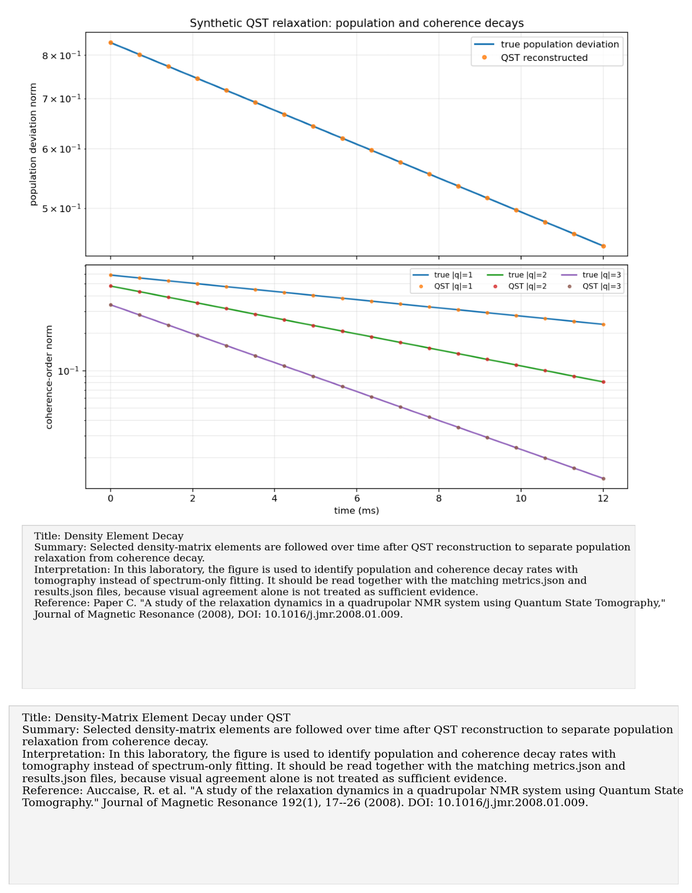
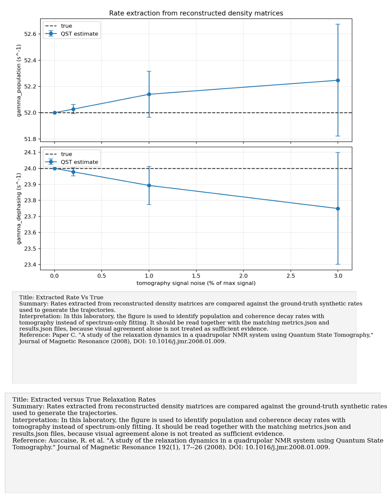
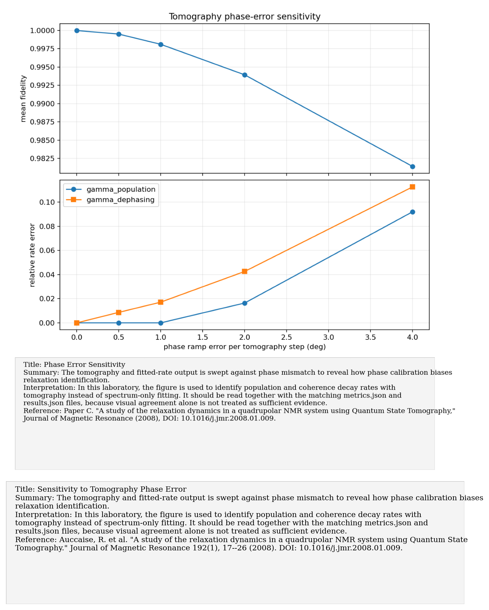
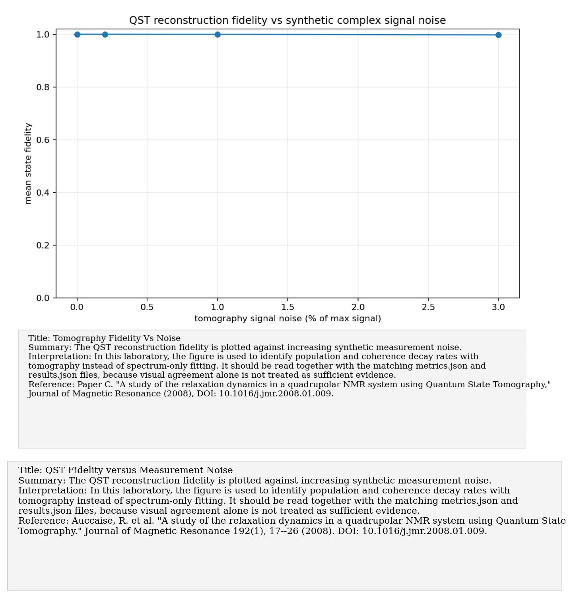

# Paper C: Relaxation dynamics in a quadrupolar NMR system using QST

Paper/workflow ID: `qst_relaxation_2008`

Category: `QST relaxation`

## Primary Reference

Auccaise, R. et al. "A study of the relaxation dynamics in a quadrupolar NMR system using Quantum State Tomography." Journal of Magnetic Resonance 192(1), 17--26 (2008). DOI: 10.1016/j.jmr.2008.01.009.

## Article Summary

This paper studies relaxation dynamics in a quadrupolar NMR system using quantum state tomography. Instead of inferring relaxation only from spectra or envelopes, it reconstructs density matrices over time and extracts rates from the evolution of populations and coherences.

## Scientific Insights

The major insight is identifiability: tomography separates population relaxation and coherence decay more directly than a single FID spectrum. It also exposes phase errors and reconstruction instability that a magnitude spectrum could hide.

## Implemented Laboratory Model

Synthetic trajectories, seven-phase QST, rate extraction, noise stress tests.

## Direct Comparison with the Published Reference

Our synthetic workflow reproduces the structure of the protocol: generate state trajectories, simulate QST signals, reconstruct density matrices, and fit rates. The noiseless recovery works essentially exactly, while noisy tests show how uncertainty propagates into fitted rates.

## Interpretation for the Present Study

QST can identify population and coherence decay rates beyond spectrum-only fitting.

## Experimental Implication

This should be the template for the first serious experimental validation: collect the seven-phase tomography series at multiple delay times and compare reconstructed density-matrix trajectories to the synthetic model.

## Current Deviations from the Published Reference

Uses synthetic tomography signals; real extraction requires experimental amplitude calibration.

## Key Metrics

- `noiseless_reconstruction.mean_fidelity`: `1`
- `noiseless_reconstruction.gamma_population_estimate`: `52`

## Figure Guide

### Figure 1. Density-Matrix Element Decay under QST

- Summary: Selected density-matrix elements are followed over time after QST reconstruction to separate population relaxation from coherence decay.
- Interpretation: In this laboratory, the figure is used to identify population and coherence decay rates with tomography instead of spectrum-only fitting. It should be read together with the matching metrics.json and results.json files, because visual agreement alone is not treated as sufficient evidence.
- Reference: Auccaise, R. et al. "A study of the relaxation dynamics in a quadrupolar NMR system using Quantum State Tomography." Journal of Magnetic Resonance 192(1), 17--26 (2008). DOI: 10.1016/j.jmr.2008.01.009.

### Figure 2. Extracted versus True Relaxation Rates

- Summary: Rates extracted from reconstructed density matrices are compared against the ground-truth synthetic rates used to generate the trajectories.
- Interpretation: In this laboratory, the figure is used to identify population and coherence decay rates with tomography instead of spectrum-only fitting. It should be read together with the matching metrics.json and results.json files, because visual agreement alone is not treated as sufficient evidence.
- Reference: Auccaise, R. et al. "A study of the relaxation dynamics in a quadrupolar NMR system using Quantum State Tomography." Journal of Magnetic Resonance 192(1), 17--26 (2008). DOI: 10.1016/j.jmr.2008.01.009.

### Figure 3. Sensitivity to Tomography Phase Error

- Summary: The tomography and fitted-rate output is swept against phase mismatch to reveal how phase calibration biases relaxation identification.
- Interpretation: In this laboratory, the figure is used to identify population and coherence decay rates with tomography instead of spectrum-only fitting. It should be read together with the matching metrics.json and results.json files, because visual agreement alone is not treated as sufficient evidence.
- Reference: Auccaise, R. et al. "A study of the relaxation dynamics in a quadrupolar NMR system using Quantum State Tomography." Journal of Magnetic Resonance 192(1), 17--26 (2008). DOI: 10.1016/j.jmr.2008.01.009.

### Figure 4. QST Fidelity versus Measurement Noise

- Summary: The QST reconstruction fidelity is plotted against increasing synthetic measurement noise.
- Interpretation: In this laboratory, the figure is used to identify population and coherence decay rates with tomography instead of spectrum-only fitting. It should be read together with the matching metrics.json and results.json files, because visual agreement alone is not treated as sufficient evidence.
- Reference: Auccaise, R. et al. "A study of the relaxation dynamics in a quadrupolar NMR system using Quantum State Tomography." Journal of Magnetic Resonance 192(1), 17--26 (2008). DOI: 10.1016/j.jmr.2008.01.009.

## Canonical Artifacts

- Metrics: `outputs/repro/qst_relaxation_2008/latest/metrics.json`
- Config: `outputs/repro/qst_relaxation_2008/latest/config_used.json`
- Results: `outputs/repro/qst_relaxation_2008/latest/results.json`
