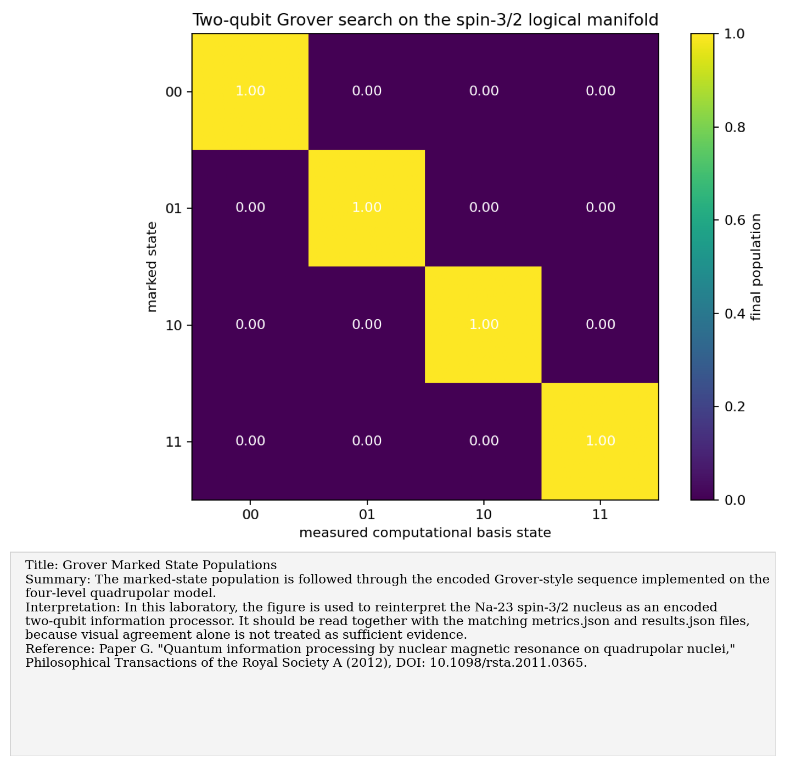
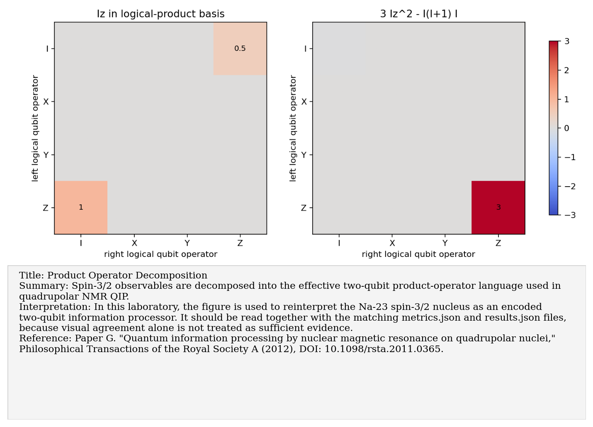
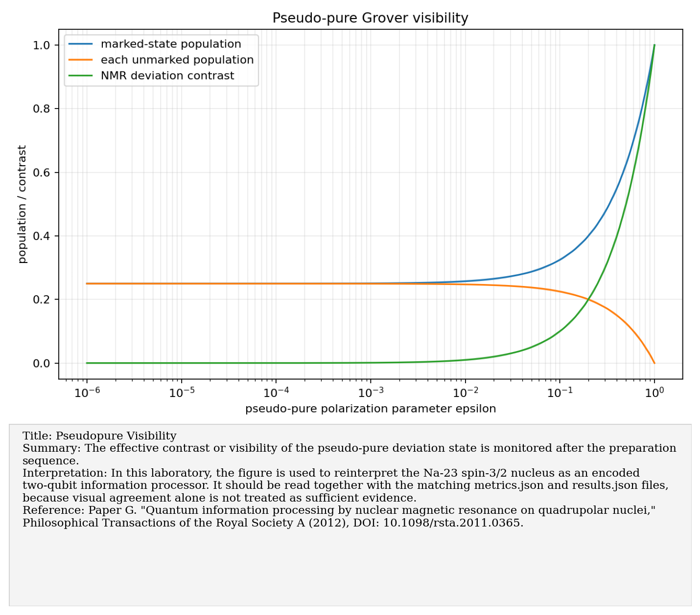

# Paper G: Quadrupolar nuclei for NMR quantum information processing

Paper/workflow ID: `quadrupolar_qip_2012`

Category: `Encoded QIP`

## Primary Reference

Paper G. "Quantum information processing by nuclear magnetic resonance on quadrupolar nuclei," Philosophical Transactions of the Royal Society A (2012), DOI: 10.1098/rsta.2011.0365.

## Article Summary

This paper reviews quantum information processing with quadrupolar nuclei in NMR. It treats a spin-3/2 nucleus as a four-level system that can encode two logical qubits and support pseudo-pure states, gates, and tomography.

## Scientific Insights

The important insight is the dual identity of the system: it is simultaneously a quadrupolar NMR object and an encoded two-qubit register. Product-operator decompositions make that connection explicit.

## Implemented Laboratory Model

Product-operator decompositions, pseudo-pure states, Grover benchmark, synthetic QST.

## Direct Laboratory Comparison

Our reproduction validated the mapping from spin operators to encoded two-qubit product operators and reproduced ideal Grover-style behavior under synthetic assumptions. This links the Na-23 spectroscopy code to quantum-information protocols.

## Project Lesson

Na-23 can be modeled both as quadrupolar NMR and as an encoded four-level QIP platform.

## Next Laboratory Use

Use this paper to decide how to label states, transitions, pseudo-pure preparations, and logical operations in future lab notes.

## Known Limitations

Ideal encoded operations are synthetic and require pulse-level implementation for experiments.

## Key Metrics

- `product_operator_decomposition.iz_nonzero_coefficients.IZ`: `0.5`
- `product_operator_decomposition.iz_nonzero_coefficients.ZI`: `1`
- `product_operator_decomposition.quadrupolar_traceless_nonzero_coefficients.ZZ`: `3`
- `product_operator_decomposition.iz_reconstruction_residual`: `0`
- `product_operator_decomposition.quadrupolar_reconstruction_residual`: `0`
- `grover_ideal.min_marked_population`: `1`

## Figure Guide

### Figure 1. Grover Marked State Populations

- Summary: The marked-state population is followed through the encoded Grover-style sequence implemented on the four-level quadrupolar model.
- Interpretation: In this laboratory, the figure is used to reinterpret the Na-23 spin-3/2 nucleus as an encoded two-qubit information processor. It should be read together with the matching metrics.json and results.json files, because visual agreement alone is not treated as sufficient evidence.
- Reference: Paper G. "Quantum information processing by nuclear magnetic resonance on quadrupolar nuclei," Philosophical Transactions of the Royal Society A (2012), DOI: 10.1098/rsta.2011.0365.

### Figure 2. Product Operator Decomposition

- Summary: Spin-3/2 observables are decomposed into the effective two-qubit product-operator language used in quadrupolar NMR QIP.
- Interpretation: In this laboratory, the figure is used to reinterpret the Na-23 spin-3/2 nucleus as an encoded two-qubit information processor. It should be read together with the matching metrics.json and results.json files, because visual agreement alone is not treated as sufficient evidence.
- Reference: Paper G. "Quantum information processing by nuclear magnetic resonance on quadrupolar nuclei," Philosophical Transactions of the Royal Society A (2012), DOI: 10.1098/rsta.2011.0365.

### Figure 3. Pseudopure Visibility

- Summary: The effective contrast or visibility of the pseudo-pure deviation state is monitored after the preparation sequence.
- Interpretation: In this laboratory, the figure is used to reinterpret the Na-23 spin-3/2 nucleus as an encoded two-qubit information processor. It should be read together with the matching metrics.json and results.json files, because visual agreement alone is not treated as sufficient evidence.
- Reference: Paper G. "Quantum information processing by nuclear magnetic resonance on quadrupolar nuclei," Philosophical Transactions of the Royal Society A (2012), DOI: 10.1098/rsta.2011.0365.

### Figure 4. Qst Noise Sensitivity

- Summary: The reconstructed encoded-state fidelity is tracked as synthetic noise is added to the tomography signals.
- Interpretation: In this laboratory, the figure is used to reinterpret the Na-23 spin-3/2 nucleus as an encoded two-qubit information processor. It should be read together with the matching metrics.json and results.json files, because visual agreement alone is not treated as sufficient evidence.
- Reference: Paper G. "Quantum information processing by nuclear magnetic resonance on quadrupolar nuclei," Philosophical Transactions of the Royal Society A (2012), DOI: 10.1098/rsta.2011.0365.

## Canonical Artifacts

- Metrics: `outputs/repro/quadrupolar_qip_2012/latest/metrics.json`
- Config: `outputs/repro/quadrupolar_qip_2012/latest/config_used.json`
- Results: `outputs/repro/quadrupolar_qip_2012/latest/results.json`
