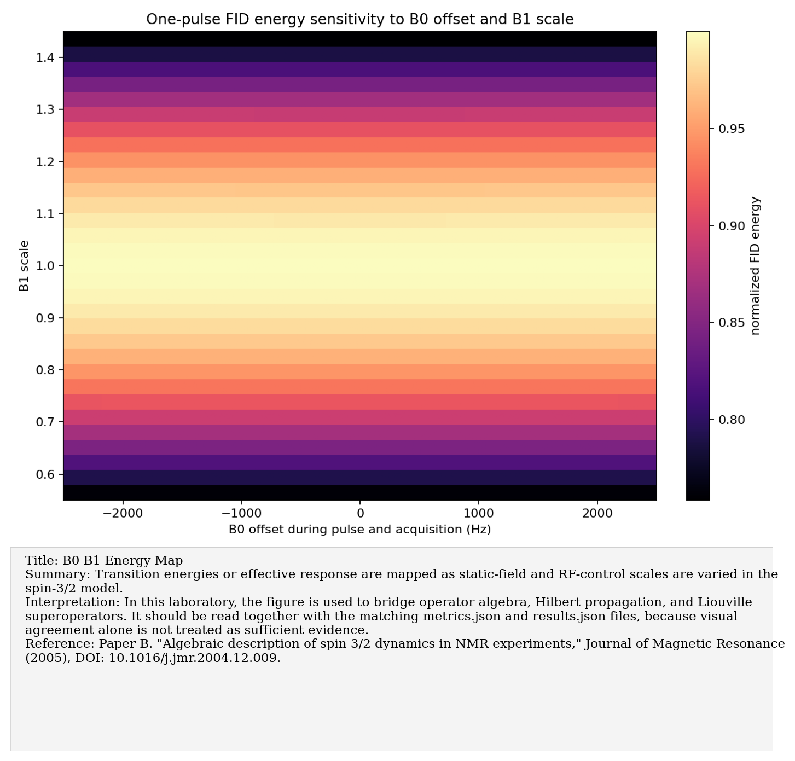
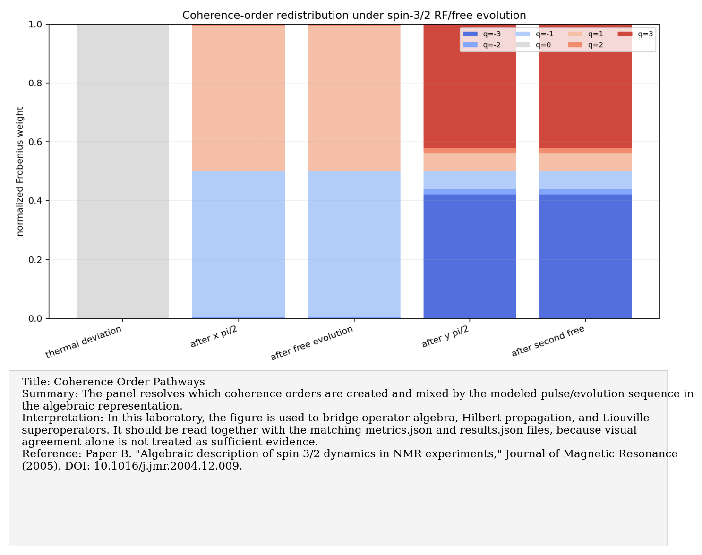
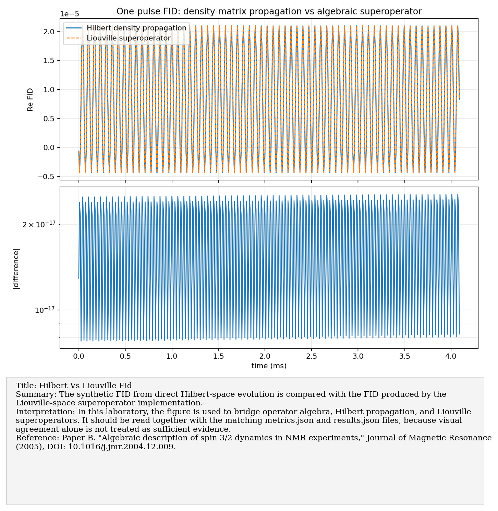
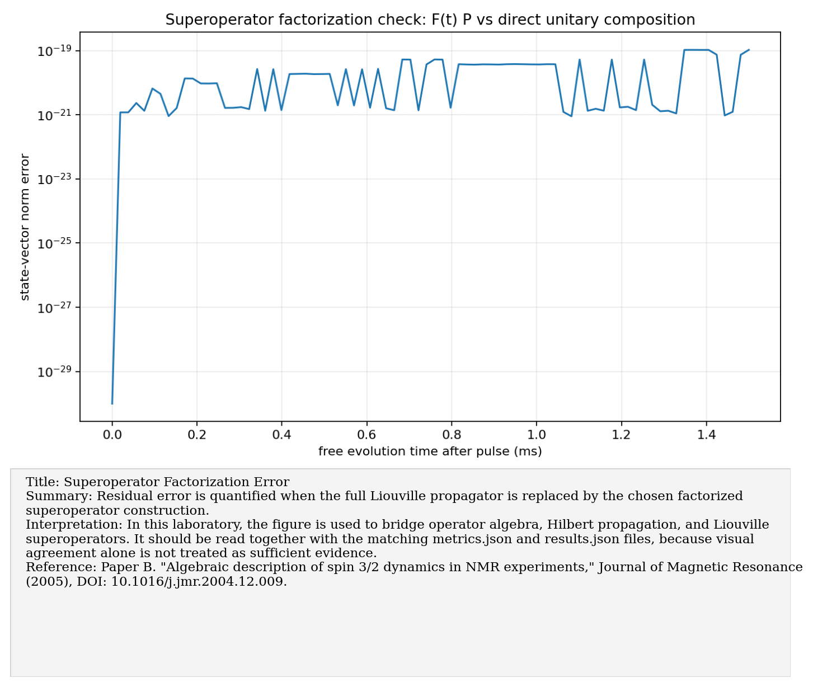

# Paper B: Algebraic description of spin 3/2 dynamics in NMR

Paper/workflow ID: `spin32_algebraic_2004`

Category: `Spin-3/2 algebra`

## Primary Reference

Paper B. "Algebraic description of spin 3/2 dynamics in NMR experiments," Journal of Magnetic Resonance (2005), DOI: 10.1016/j.jmr.2004.12.009.

## Article Summary

The algebraic spin-3/2 paper gives an operator-level description of quadrupolar NMR dynamics. It is directly aligned with this project because our platform is a four-level spin-3/2 system, and the paper's formalism maps naturally into Hilbert-space and Liouville-space propagation.

## Scientific Insights

The key insight is that spin-3/2 NMR is not just four unrelated levels. The algebra organizes RF rotations, quadrupolar evolution, coherence orders, and detection pathways into a structured model that can be tested numerically.

## Implemented Laboratory Model

Hilbert evolution, Liouville-space superoperators, coherence-order pathways, and B0/B1 sensitivity.

## Direct Laboratory Comparison

Our reproduction directly compared Hilbert and Liouville propagation and found agreement at numerical precision. This supports using Liouville-space objects later for dissipators, superoperators, and process-level modeling.

## Project Lesson

The Liouville formalism is numerically consistent with Hilbert propagation and ready for dissipative extensions.

## Next Laboratory Use

Use this formalism when translating experimental pulse sequences into code: define the operator basis first, then compare predicted coherence pathways with measured spectra or tomography amplitudes.

## Known Limitations

Synthetic dynamics only; experiment-specific pulse calibration is not inferred.

## Key Metrics

- `hilbert_vs_liouville.max_abs_fid_error`: `2.5455e-17`

## Figure Guide

### Figure 1. B0 B1 Energy Map

- Summary: Transition energies or effective response are mapped as static-field and RF-control scales are varied in the spin-3/2 model.
- Interpretation: In this laboratory, the figure is used to bridge operator algebra, Hilbert propagation, and Liouville superoperators. It should be read together with the matching metrics.json and results.json files, because visual agreement alone is not treated as sufficient evidence.
- Reference: Paper B. "Algebraic description of spin 3/2 dynamics in NMR experiments," Journal of Magnetic Resonance (2005), DOI: 10.1016/j.jmr.2004.12.009.

### Figure 2. Coherence Order Pathways

- Summary: The panel resolves which coherence orders are created and mixed by the modeled pulse/evolution sequence in the algebraic representation.
- Interpretation: In this laboratory, the figure is used to bridge operator algebra, Hilbert propagation, and Liouville superoperators. It should be read together with the matching metrics.json and results.json files, because visual agreement alone is not treated as sufficient evidence.
- Reference: Paper B. "Algebraic description of spin 3/2 dynamics in NMR experiments," Journal of Magnetic Resonance (2005), DOI: 10.1016/j.jmr.2004.12.009.

### Figure 3. Hilbert Vs Liouville Fid

- Summary: The synthetic FID from direct Hilbert-space evolution is compared with the FID produced by the Liouville-space superoperator implementation.
- Interpretation: In this laboratory, the figure is used to bridge operator algebra, Hilbert propagation, and Liouville superoperators. It should be read together with the matching metrics.json and results.json files, because visual agreement alone is not treated as sufficient evidence.
- Reference: Paper B. "Algebraic description of spin 3/2 dynamics in NMR experiments," Journal of Magnetic Resonance (2005), DOI: 10.1016/j.jmr.2004.12.009.

### Figure 4. Superoperator Factorization Error

- Summary: Residual error is quantified when the full Liouville propagator is replaced by the chosen factorized superoperator construction.
- Interpretation: In this laboratory, the figure is used to bridge operator algebra, Hilbert propagation, and Liouville superoperators. It should be read together with the matching metrics.json and results.json files, because visual agreement alone is not treated as sufficient evidence.
- Reference: Paper B. "Algebraic description of spin 3/2 dynamics in NMR experiments," Journal of Magnetic Resonance (2005), DOI: 10.1016/j.jmr.2004.12.009.

## Canonical Artifacts

- Metrics: `outputs/repro/spin32_algebraic_2004/latest/metrics.json`
- Config: `outputs/repro/spin32_algebraic_2004/latest/config_used.json`
- Results: `outputs/repro/spin32_algebraic_2004/latest/results.json`
