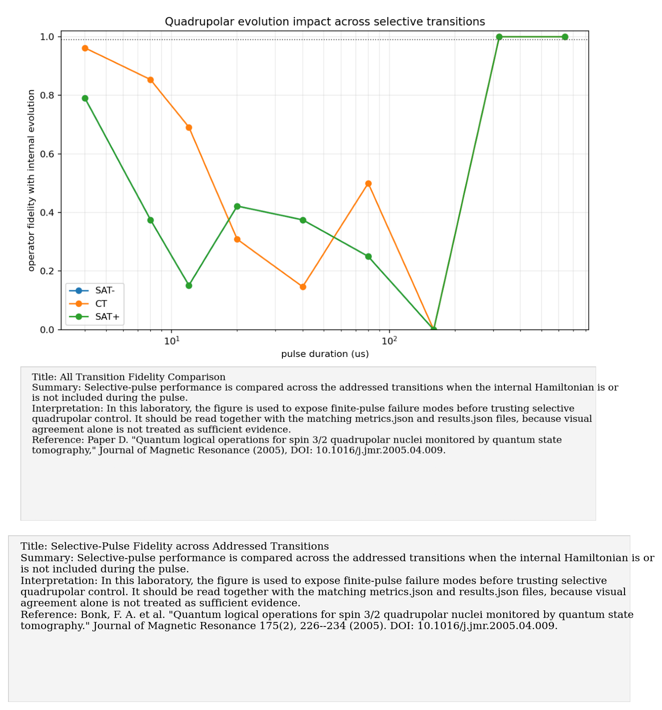
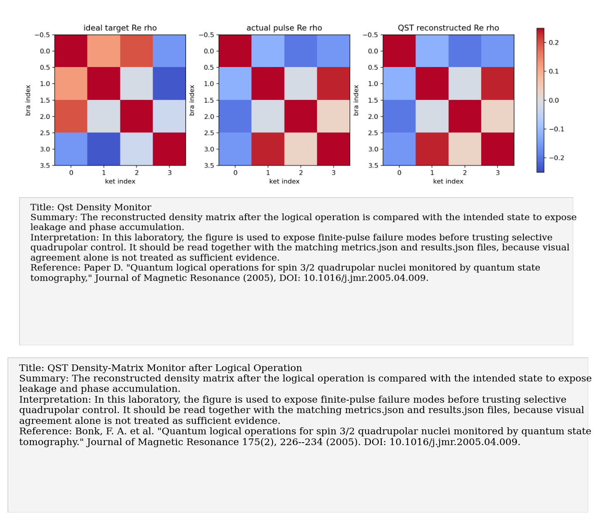

# Paper D: Spin-3/2 quantum logical operations monitored by QST

Paper/workflow ID: `spin32_qlogic_qst_2005`

Category: `Selective control`

## Primary Reference

Bonk, F. A. et al. "Quantum logical operations for spin 3/2 quadrupolar nuclei monitored by quantum state tomography." Journal of Magnetic Resonance 175(2), 226--234 (2005). DOI: 10.1016/j.jmr.2005.04.009.

## Article Summary

This paper demonstrates spin-3/2 quadrupolar logical operations monitored by QST. Its relevance is not only the logic operation itself but the warning that finite pulse duration and quadrupolar evolution during the pulse can strongly affect the actual operation.

## Scientific Insights

The key insight is that a selective pulse is not automatically an ideal two-level gate embedded in a four-level system. During long pulses, the internal Hamiltonian keeps acting, and the intended transition-selective rotation can accumulate unwanted phases or leakage.

## Implemented Laboratory Model

Selective rectangular pulses with and without internal quadrupolar evolution.

## Direct Comparison with the Published Reference

Our benchmark compared pulses with and without internal quadrupolar evolution. The contrast was severe: the idealized model can look perfect while the physically evolved pulse fails. This made the later GRAPE reproduction necessary.

## Interpretation for the Present Study

Ignoring quadrupolar evolution during pulses can destroy coherent gate fidelity.

## Experimental Implication

Do not trust rectangular selective-pulse designs without simulating the full Hamiltonian during the pulse. Use QST to check the actual state after the pulse.

## Current Deviations from the Published Reference

Rectangular pulses are diagnostic baselines; optimized pulses are handled by the GRAPE layer.

## Key Metrics

- `fidelity_summary.min_operator_fidelity_with_quadrupolar`: `2.2414e-15`

## Figure Guide

### Figure 1. Selective-Pulse Fidelity across Addressed Transitions

- Summary: Selective-pulse performance is compared across the addressed transitions when the internal Hamiltonian is or is not included during the pulse.
- Interpretation: In this laboratory, the figure is used to expose finite-pulse failure modes before trusting selective quadrupolar control. It should be read together with the matching metrics.json and results.json files, because visual agreement alone is not treated as sufficient evidence.
- Reference: Bonk, F. A. et al. "Quantum logical operations for spin 3/2 quadrupolar nuclei monitored by quantum state tomography." Journal of Magnetic Resonance 175(2), 226--234 (2005). DOI: 10.1016/j.jmr.2005.04.009.

### Figure 2. Population Transfer versus Pulse Duration

- Summary: Target population transfer is tracked as pulse duration changes, exposing the trade-off between selectivity and unwanted internal evolution.
- Interpretation: In this laboratory, the figure is used to expose finite-pulse failure modes before trusting selective quadrupolar control. It should be read together with the matching metrics.json and results.json files, because visual agreement alone is not treated as sufficient evidence.
- Reference: Bonk, F. A. et al. "Quantum logical operations for spin 3/2 quadrupolar nuclei monitored by quantum state tomography." Journal of Magnetic Resonance 175(2), 226--234 (2005). DOI: 10.1016/j.jmr.2005.04.009.

### Figure 3. QST Density-Matrix Monitor after Logical Operation

- Summary: The reconstructed density matrix after the logical operation is compared with the intended state to expose leakage and phase accumulation.
- Interpretation: In this laboratory, the figure is used to expose finite-pulse failure modes before trusting selective quadrupolar control. It should be read together with the matching metrics.json and results.json files, because visual agreement alone is not treated as sufficient evidence.
- Reference: Bonk, F. A. et al. "Quantum logical operations for spin 3/2 quadrupolar nuclei monitored by quantum state tomography." Journal of Magnetic Resonance 175(2), 226--234 (2005). DOI: 10.1016/j.jmr.2005.04.009.

### Figure 4. Selective-Pulse Fidelity versus Duration

- Summary: Logical-operation fidelity is plotted against pulse duration for the idealized pulse model and the full-Hamiltonian pulse model.
- Interpretation: In this laboratory, the figure is used to expose finite-pulse failure modes before trusting selective quadrupolar control. It should be read together with the matching metrics.json and results.json files, because visual agreement alone is not treated as sufficient evidence.
- Reference: Bonk, F. A. et al. "Quantum logical operations for spin 3/2 quadrupolar nuclei monitored by quantum state tomography." Journal of Magnetic Resonance 175(2), 226--234 (2005). DOI: 10.1016/j.jmr.2005.04.009.

## Canonical Artifacts

- Metrics: `outputs/repro/spin32_qlogic_qst_2005/latest/metrics.json`
- Config: `outputs/repro/spin32_qlogic_qst_2005/latest/config_used.json`
- Results: `outputs/repro/spin32_qlogic_qst_2005/latest/results.json`
