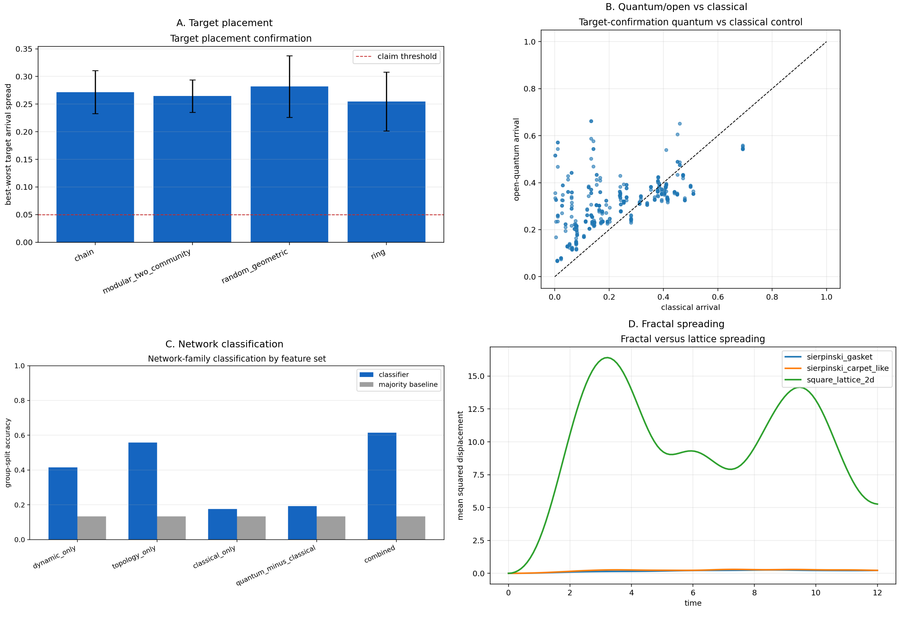

# Article Figure Pack Claims

Generated at UTC: 2026-04-22T03:12:14.677296+00:00

## Allowed Claims

- Target placement has a confirmed effect in `4` focused families if CI95 lower bound exceeds `0.05`.
- Open-quantum transport differs from the classical rate-walk control in `220` target-control cases.
- Existing classification result: combined dynamic+topological features reach `0.615` accuracy versus baseline `0.133`.
- Fractal follow-up verdict: `True`.

## Claims Not Yet Allowed

- Do not claim microscopic simulation of photosynthesis, perovskites, or superconducting hardware.
- Do not claim graph-family classification from dynamics alone is complete; topology plus dynamics remains stronger.
- Do not claim fractals are part of the main classifier until they are added to the classification campaign.

## Figure

## Source Metrics

- Journey V2 target spread mean: `0.20763562930059976`.
- Target confirmation numerics pass: `True`.
- Fractal numerics pass: `True`.