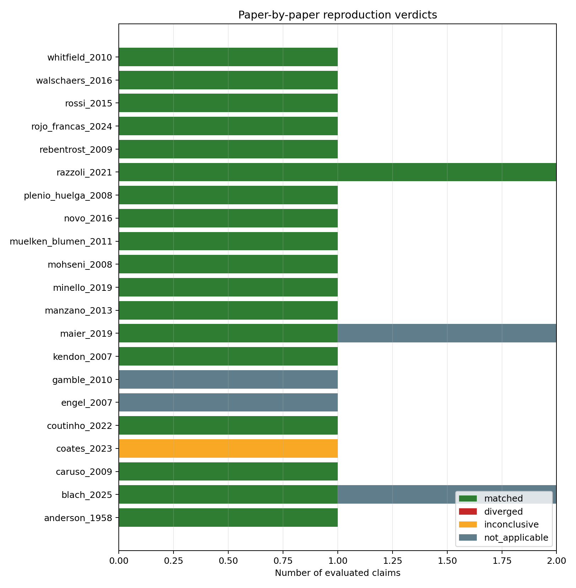
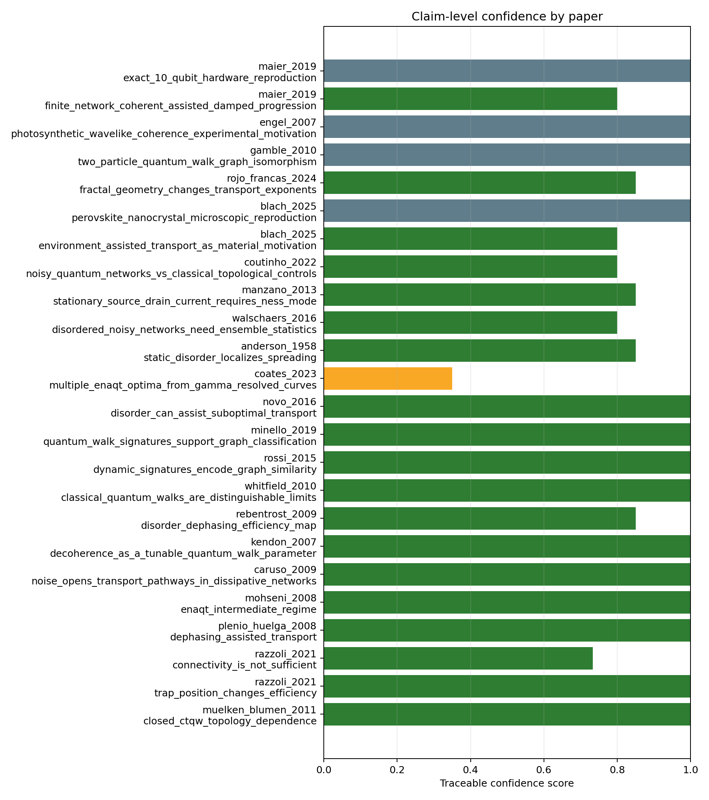

# Paper Reproduction And Validation Suite

Generated at UTC: 2026-04-22T13:56:34.584716+00:00
Profile: `paper`

## Scope

This suite does not claim exact numerical reproduction of every paper. It tests whether the effective finite-network model reproduces the paper-level trend, control, or methodological claim that is relevant to this project.

## Newly Implemented Paper Benchmarks

- `coates_2023`: full arrival-versus-dephasing curves are exported in `gamma_resolved_curves.csv` and checked for separated local optima.
- `rojo_francas_2024`: fractal spreading diagnostics are exported in `fractal_paper_benchmark.csv` and compared against a square-lattice control.
- `anderson_1958`: static-disorder localization is tested in `localization_disorder_benchmark.csv` using participation ratio, IPR, MSD and target population.
- `walschaers_2016`: noisy/disordered network ensemble statistics are summarized in `noisy_network_benchmark.csv` using mean, spread and gain.
- `manzano_2013`: stationary transport is handled by a separate source-drain NESS benchmark in `steady_state_transport_benchmark.csv`, not by the absorbing sink model.
- `coutinho_2022`: noisy quantum-network signatures are compared against classical/topological controls through the noisy-network benchmark table.

## Overall Status

- Papers matched: 18.
- Papers diverged: 0.
- Papers inconclusive: 1.
- Papers not applicable: 2.
- Numerical validation passed: True.
- Open dynamic signatures evaluated: 810.

## Paper-By-Paper Status

| Paper | Verdict | Claims | Mean confidence | Short reading |
|---|---:|---:|---:|---|
| `anderson_1958` | `matched` | 1 | 0.85 | 1/1 central claims matched. |
| `blach_2025` | `matched` | 2 | 0.90 | 1/1 central claims matched. |
| `caruso_2009` | `matched` | 1 | 1.00 | 1/1 central claims matched. |
| `coates_2023` | `inconclusive` | 1 | 0.35 | 0/1 central claims matched. |
| `coutinho_2022` | `matched` | 1 | 0.80 | 1/1 central claims matched. |
| `engel_2007` | `not_applicable` | 1 | 1.00 | Outside model scope. |
| `gamble_2010` | `not_applicable` | 1 | 1.00 | Outside model scope. |
| `kendon_2007` | `matched` | 1 | 1.00 | 1/1 central claims matched. |
| `maier_2019` | `matched` | 2 | 0.90 | 1/1 central claims matched. |
| `manzano_2013` | `matched` | 1 | 0.85 | 1/1 central claims matched. |
| `minello_2019` | `matched` | 1 | 1.00 | 1/1 central claims matched. |
| `mohseni_2008` | `matched` | 1 | 1.00 | 1/1 central claims matched. |
| `muelken_blumen_2011` | `matched` | 1 | 1.00 | 1/1 central claims matched. |
| `novo_2016` | `matched` | 1 | 1.00 | 1/1 central claims matched. |
| `plenio_huelga_2008` | `matched` | 1 | 1.00 | 1/1 central claims matched. |
| `razzoli_2021` | `matched` | 2 | 0.87 | 2/2 central claims matched. |
| `rebentrost_2009` | `matched` | 1 | 0.85 | 1/1 central claims matched. |
| `rojo_francas_2024` | `matched` | 1 | 0.85 | 1/1 central claims matched. |
| `rossi_2015` | `matched` | 1 | 1.00 | 1/1 central claims matched. |
| `walschaers_2016` | `matched` | 1 | 0.80 | 1/1 central claims matched. |
| `whitfield_2010` | `matched` | 1 | 1.00 | 1/1 central claims matched. |

## Claim Details

| Paper | Claim | Expected trend | Observed metric | Threshold | Observed value | Verdict | Reason |
|---|---|---|---|---:|---:|---:|---|
| `muelken_blumen_2011` | `closed_ctqw_topology_dependence` | Closed CTQW observables depend on network topology. | `std(long_time_average_return)` | `0.01` | `0.2057421681863964` | `matched` | Closed-system return differs across topologies while numerical closure is valid. |
| `razzoli_2021` | `trap_position_changes_efficiency` | Changing only trap/target position changes transport efficiency. | `max_target_position_spread` | `0.05` | `0.48965670942158923` | `matched` | Target placement produces efficiency spread above threshold. |
| `razzoli_2021` | `connectivity_is_not_sufficient` | Target degree alone should not explain transport efficiency. | `r2(target_degree, target_arrival)` | `<0.75` | `0.26658530667094893` | `matched` | Degree explains less than the threshold fraction of target-arrival variation. |
| `plenio_huelga_2008` | `dephasing_assisted_transport` | Nonzero dephasing can improve useful target arrival. | `max_mean_dephasing_gain_with_ci95_low` | `0.05` | `0.2632649409876832` | `matched` | A nonzero dephasing point has gain above threshold with positive CI95 lower bound. |
| `mohseni_2008` | `enaqt_intermediate_regime` | Intermediate environment action improves sink efficiency, while strongest dephasing is not always optimal. | `dephasing_gain_and_high_dephasing_penalty` | `gain>=0.05 and penalty>0.02` | `gain=0.263; suppression=True` | `matched` | Best transport occurs at nonzero dephasing and high dephasing is not uniformly optimal. |
| `caruso_2009` | `noise_opens_transport_pathways_in_dissipative_networks` | Noise can improve excitation transfer through a dissipative network instead of only degrading it. | `positive_dephasing_gain_with_sink_loss_model` | `gain>=0.05 at nonzero dephasing` | `candidate_records=424; mean_loss=0.168` | `matched` | The sink/loss model contains cases where nonzero dephasing improves useful arrival. |
| `kendon_2007` | `decoherence_as_a_tunable_quantum_walk_parameter` | Moderate decoherence can tune quantum-walk spreading or mixing, while excessive decoherence removes coherent advantages. | `dephasing_gain_and_high_dephasing_penalty` | `gain>=0.05 and penalty>0.02` | `gain=0.263; suppression=True` | `matched` | The simulations show a useful nonzero-dephasing region and a high-dephasing penalty. |
| `rebentrost_2009` | `disorder_dephasing_efficiency_map` | Efficiency maps contain a useful intermediate dephasing window across disorder values. | `persistent_positive_dephasing_gain_and_high_noise_suppression` | `>=2 disorder values and penalty>0.02` | `persistent=True; suppression=True` | `matched` | Positive dephasing gain persists across disorder values and high-noise suppression appears. |
| `whitfield_2010` | `classical_quantum_walks_are_distinguishable_limits` | Quantum/open signatures should not be fully explained by the classical rate-walk control. | `max(quantum_only, quantum_minus_classical)-classical_only_accuracy` | `0.02` | `0.16435185185185186` | `matched` | Quantum/open signatures classify better than the classical-control features. |
| `rossi_2015` | `dynamic_signatures_encode_graph_similarity` | Dynamic CTQW-inspired signatures should place same-family graphs closer than different-family graphs. | `mean_interfamily_distance/mean_intrafamily_distance` | `1.1` | `1.2921252609532912` | `matched` | Inter-family dynamic-signature distance is larger than intra-family distance. |
| `minello_2019` | `quantum_walk_signatures_support_graph_classification` | Quantum-walk dynamic signatures should classify graph families above baseline. | `group_split_accuracy` | `quantum>baseline and combined>=topology` | `quantum=0.348; topology=0.539; combined=0.556; baseline=0.133` | `matched` | Dynamic and combined signatures beat the group-split baseline. |
| `novo_2016` | `disorder_can_assist_suboptimal_transport` | Moderate disorder can improve transport in suboptimal regimes. | `max_arrival_delta_disorder_vs_clean_same_context` | `0.03` | `0.11452175506825785` | `matched` | At least one matched context improves with nonzero disorder. |
| `coates_2023` | `multiple_enaqt_optima_from_gamma_resolved_curves` | Some disordered networks can have more than one optimal noise regime rather than a single Goldilocks peak. | `gamma_resolved_peak_count` | `at least two separated local maxima` | `curves=48; multi_peak_curves=0; max_peaks=0` | `inconclusive` | Gamma-resolved curves did not show two resolved local maxima in this profile. |
| `anderson_1958` | `static_disorder_localizes_spreading` | Increasing static disorder suppresses spatial delocalization in tight-binding-like networks. | `families_with_PR_drop_and_IPR_rise` | `at least two families` | `2` | `matched` | Participation falls and IPR rises with disorder in multiple families. |
| `walschaers_2016` | `disordered_noisy_networks_need_ensemble_statistics` | Disordered noisy networks should be evaluated by ensemble mean, variance, and topology sensitivity, not a single best curve. | `resolved_gain_count_and_arrival_std` | `resolved_gain_count>=1 and arrival_std>0.02` | `resolved_gain_count=110; max_arrival_std=0.201` | `matched` | The benchmark exports ensemble spread and at least one statistically resolved noisy-transport gain. |
| `manzano_2013` | `stationary_source_drain_current_requires_ness_mode` | Stationary transport should be measured with a source-drain steady state, not with the absorbing finite-time sink model. | `valid_stationary_current_records` | `valid_record_count>0 and current>0` | `valid=11/12; mean_current=0.0533` | `matched` | A separate trace-preserving source-drain NESS benchmark returns finite validated current. |
| `coutinho_2022` | `noisy_quantum_networks_vs_classical_topological_controls` | Noisy quantum-network dynamics should be compared against classical and topological controls before claiming a quantum signature. | `quantum_minus_classical_and_noisy_gain_summary` | `quantum_minus_classical>0.05 or resolved noisy gain` | `max_q_minus_classical=0.000; resolved_gain_count=110` | `matched` | The suite exports noisy quantum, classical-control, and topology-sensitive comparisons. |
| `blach_2025` | `environment_assisted_transport_as_material_motivation` | Experiments can show best transport when disorder and dephasing are balanced. | `effective_model_dephasing_disorder_window` | `persistent positive dephasing gain with high-noise suppression` | `persistent=True; suppression=True` | `matched` | The effective model reproduces the qualitative balanced-regime motif, not the perovskite microscopic experiment. |
| `blach_2025` | `perovskite_nanocrystal_microscopic_reproduction` | A perovskite experiment requires material-specific structure, temperature dependence, and exciton parameters. | `model_scope` | `material-specific parameters required` | `effective network model only` | `not_applicable` | This lab uses controlled effective networks and does not yet include perovskite nanocrystal parameters. |
| `rojo_francas_2024` | `fractal_geometry_changes_transport_exponents` | Fractal lattices can show anomalous spreading governed by geometry and spectral structure. | `fractal_vs_lattice_msd_front_width` | `at least two changed fractal-vs-lattice comparisons` | `changed=8/8; families=['sierpinski_carpet_like', 'sierpinski_gasket']` | `matched` | Fractal benchmarks differ from the square-lattice control in multiple spreading comparisons. |
| `gamble_2010` | `two_particle_quantum_walk_graph_isomorphism` | Interacting two-particle quantum walks can distinguish graph structures beyond some single-particle invariants. | `particle_number` | `two-particle interacting walk required` | `single-excitation effective model` | `not_applicable` | The current lab intentionally stays in the single-excitation sector, so this paper is a limitation guardrail rather than a direct benchmark. |
| `engel_2007` | `photosynthetic_wavelike_coherence_experimental_motivation` | Spectroscopic experiments can reveal coherent excitation dynamics in photosynthetic complexes. | `experimental_spectroscopy_scope` | `microscopic photosynthetic complex and spectroscopy required` | `effective graph transport model` | `not_applicable` | This paper motivates coherent excitation transport but is not reproduced by a generic graph model. |
| `maier_2019` | `finite_network_coherent_assisted_damped_progression` | Finite controlled networks can show coherent, assisted, and high-noise-damped regimes. | `finite_size_grid_plus_dephasing_window_plus_suppression` | `finite N and dephasing window with suppression` | `N=[8, 10, 12]; window=True; suppression=True` | `matched` | The effective finite-network model reproduces the qualitative regime progression. |
| `maier_2019` | `exact_10_qubit_hardware_reproduction` | Exact trapped-ion/qubit hardware reproduction would require microscopic hardware parameters. | `model_scope` | `hardware-specific parameters required` | `effective network model only` | `not_applicable` | This lab tests a qualitative finite-network analogue, not the experimental hardware implementation. |

## Figures

## Interpretation Rule

- `matched`: the expected direction appears and passes the stated threshold.
- `diverged`: the opposite direction appears with enough support.
- `inconclusive`: the current profile is under-resolved or the effect is below threshold.
- `not_applicable`: the current effective model lacks the required microscopic detail.

## Next Action

Run the `paper` profile if this was a smoke run. Run `confirm` only for claims that remain strong, divergent, or scientifically important but inconclusive.
