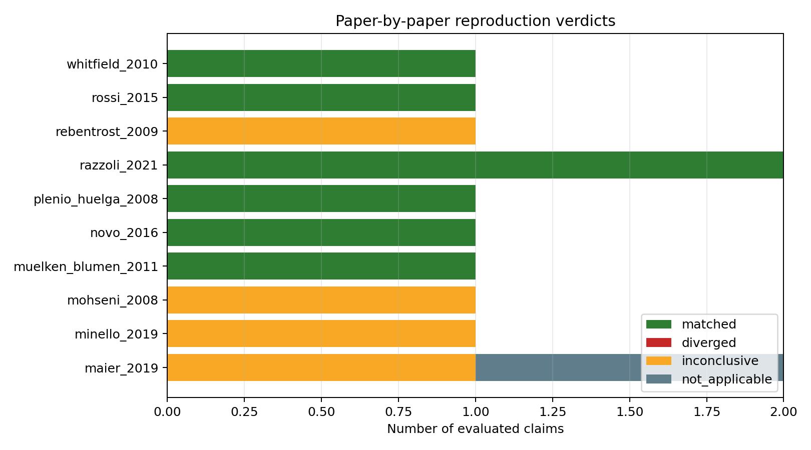
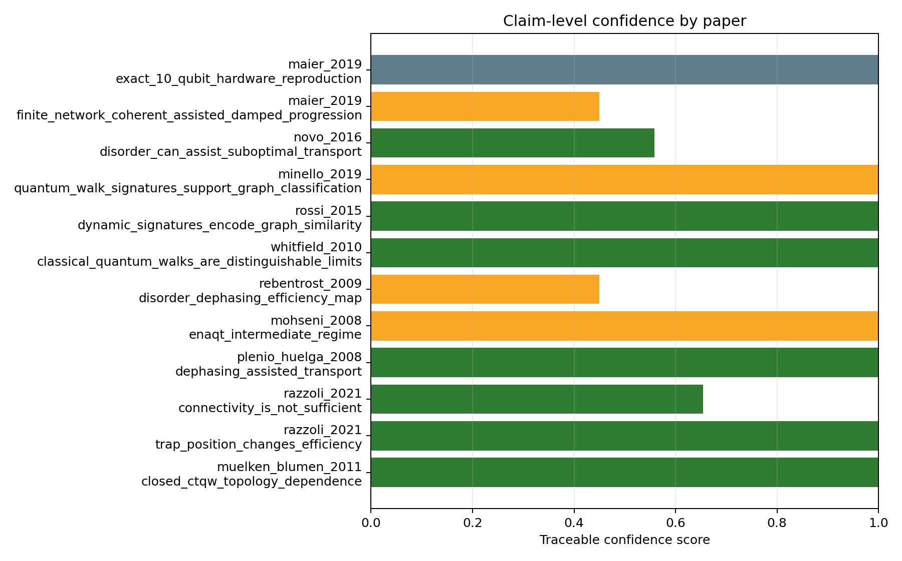

# Paper Reproduction And Validation Suite

Generated at UTC: 2026-04-21T23:30:36.012546+00:00
Profile: `smoke`

## Scope

This suite does not claim exact numerical reproduction of every paper. It tests whether the effective finite-network model reproduces the paper-level trend, control, or methodological claim that is relevant to this project.

## Overall Status

- Papers matched: 6.
- Papers diverged: 0.
- Papers inconclusive: 4.
- Papers not applicable: 0.
- Numerical validation passed: True.
- Open dynamic signatures evaluated: 72.

## Paper-By-Paper Status

| Paper | Verdict | Claims | Mean confidence | Short reading |
|---|---:|---:|---:|---|
| `maier_2019` | `inconclusive` | 2 | 0.72 | 0/1 central claims matched. |
| `minello_2019` | `inconclusive` | 1 | 1.00 | 0/1 central claims matched. |
| `mohseni_2008` | `inconclusive` | 1 | 1.00 | 0/1 central claims matched. |
| `muelken_blumen_2011` | `matched` | 1 | 1.00 | 1/1 central claims matched. |
| `novo_2016` | `matched` | 1 | 0.56 | 1/1 central claims matched. |
| `plenio_huelga_2008` | `matched` | 1 | 1.00 | 1/1 central claims matched. |
| `razzoli_2021` | `matched` | 2 | 0.83 | 2/2 central claims matched. |
| `rebentrost_2009` | `inconclusive` | 1 | 0.45 | 0/1 central claims matched. |
| `rossi_2015` | `matched` | 1 | 1.00 | 1/1 central claims matched. |
| `whitfield_2010` | `matched` | 1 | 1.00 | 1/1 central claims matched. |

## Claim Details

| Paper | Claim | Expected trend | Observed metric | Threshold | Observed value | Verdict | Reason |
|---|---|---|---|---:|---:|---:|---|
| `muelken_blumen_2011` | `closed_ctqw_topology_dependence` | Closed CTQW observables depend on network topology. | `std(long_time_average_return)` | `0.01` | `0.0994340810042527` | `matched` | Closed-system return differs across topologies while numerical closure is valid. |
| `razzoli_2021` | `trap_position_changes_efficiency` | Changing only trap/target position changes transport efficiency. | `max_target_position_spread` | `0.05` | `0.2597791049965793` | `matched` | Target placement produces efficiency spread above threshold. |
| `razzoli_2021` | `connectivity_is_not_sufficient` | Target degree alone should not explain transport efficiency. | `r2(target_degree, target_arrival)` | `<0.75` | `0.3458011651390544` | `matched` | Degree explains less than the threshold fraction of target-arrival variation. |
| `plenio_huelga_2008` | `dephasing_assisted_transport` | Nonzero dephasing can improve useful target arrival. | `max_mean_dephasing_gain_with_ci95_low` | `0.05` | `0.12628098270758703` | `matched` | A nonzero dephasing point has gain above threshold with positive CI95 lower bound. |
| `mohseni_2008` | `enaqt_intermediate_regime` | Intermediate environment action improves sink efficiency, while strongest dephasing is not always optimal. | `dephasing_gain_and_high_dephasing_penalty` | `gain>=0.05 and penalty>0.02` | `gain=0.126; suppression=False` | `inconclusive` | The high-dephasing ceiling is not clearly resolved. |
| `rebentrost_2009` | `disorder_dephasing_efficiency_map` | Efficiency maps contain a useful intermediate dephasing window across disorder values. | `persistent_positive_dephasing_gain_and_high_noise_suppression` | `>=2 disorder values and penalty>0.02` | `persistent=True; suppression=False` | `inconclusive` | The map does not yet resolve both persistence and high-noise suppression. |
| `whitfield_2010` | `classical_quantum_walks_are_distinguishable_limits` | Quantum/open signatures should not be fully explained by the classical rate-walk control. | `max(quantum_only, quantum_minus_classical)-classical_only_accuracy` | `0.02` | `0.13333333333333341` | `matched` | Quantum/open signatures classify better than the classical-control features. |
| `rossi_2015` | `dynamic_signatures_encode_graph_similarity` | Dynamic CTQW-inspired signatures should place same-family graphs closer than different-family graphs. | `mean_interfamily_distance/mean_intrafamily_distance` | `1.1` | `1.8822698571813488` | `matched` | Inter-family dynamic-signature distance is larger than intra-family distance. |
| `minello_2019` | `quantum_walk_signatures_support_graph_classification` | Quantum-walk dynamic signatures should classify graph families above baseline. | `group_split_accuracy` | `quantum>baseline and combined>=topology` | `quantum=0.867; topology=1.000; combined=0.967; baseline=0.667` | `inconclusive` | Classification is not sufficiently above controls. |
| `novo_2016` | `disorder_can_assist_suboptimal_transport` | Moderate disorder can improve transport in suboptimal regimes. | `max_arrival_delta_disorder_vs_clean_same_context` | `0.03` | `0.03579473848260134` | `matched` | At least one matched context improves with nonzero disorder. |
| `maier_2019` | `finite_network_coherent_assisted_damped_progression` | Finite controlled networks can show coherent, assisted, and high-noise-damped regimes. | `finite_size_grid_plus_dephasing_window_plus_suppression` | `finite N and dephasing window with suppression` | `N=[6]; window=True; suppression=False` | `inconclusive` | The qualitative progression is not fully resolved. |
| `maier_2019` | `exact_10_qubit_hardware_reproduction` | Exact trapped-ion/qubit hardware reproduction would require microscopic hardware parameters. | `model_scope` | `hardware-specific parameters required` | `effective network model only` | `not_applicable` | This lab tests a qualitative finite-network analogue, not the experimental hardware implementation. |

## Figures

## Interpretation Rule

- `matched`: the expected direction appears and passes the stated threshold.
- `diverged`: the opposite direction appears with enough support.
- `inconclusive`: the current profile is under-resolved or the effect is below threshold.
- `not_applicable`: the current effective model lacks the required microscopic detail.

## Next Action

Run the `paper` profile if this was a smoke run. Run `confirm` only for claims that remain strong, divergent, or scientifically important but inconclusive.
