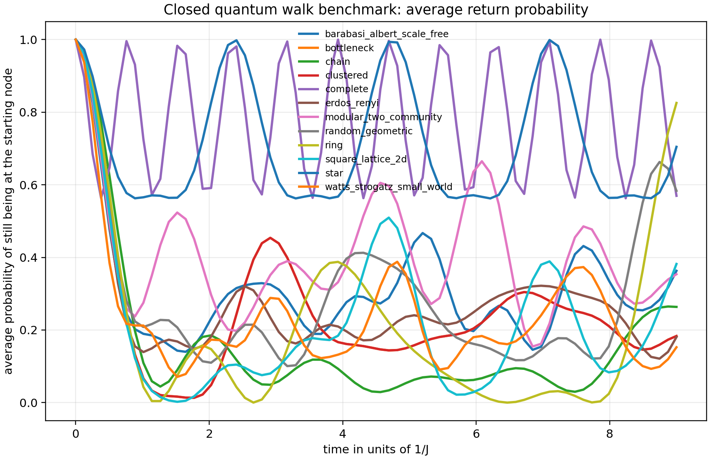
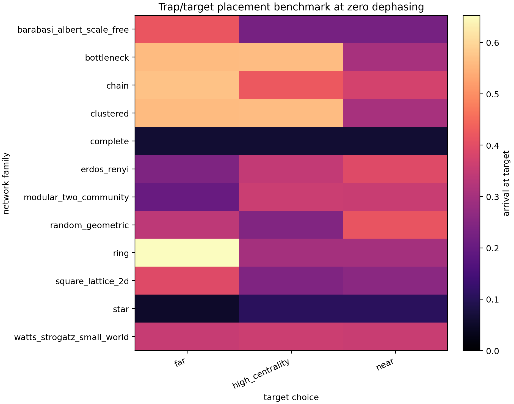
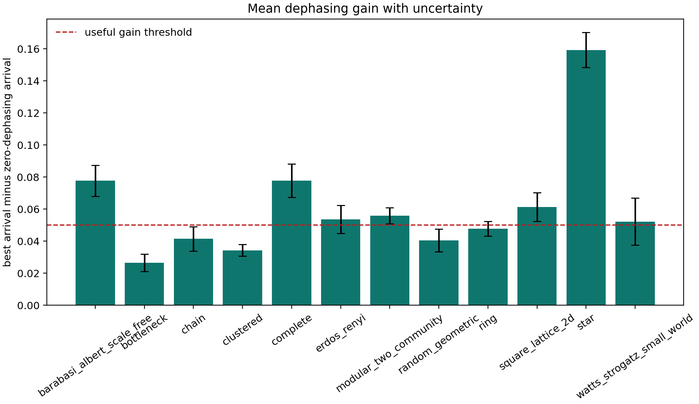
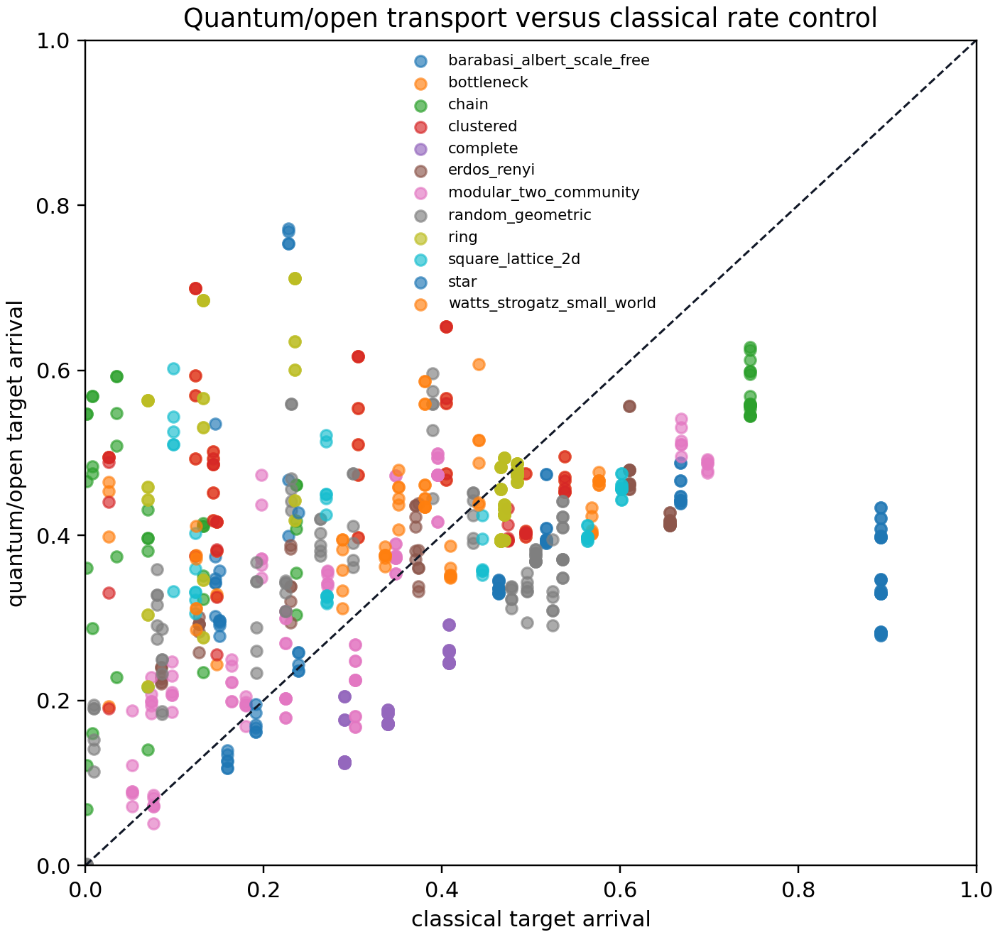
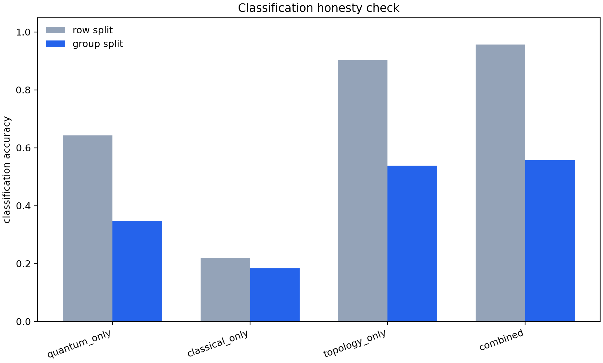
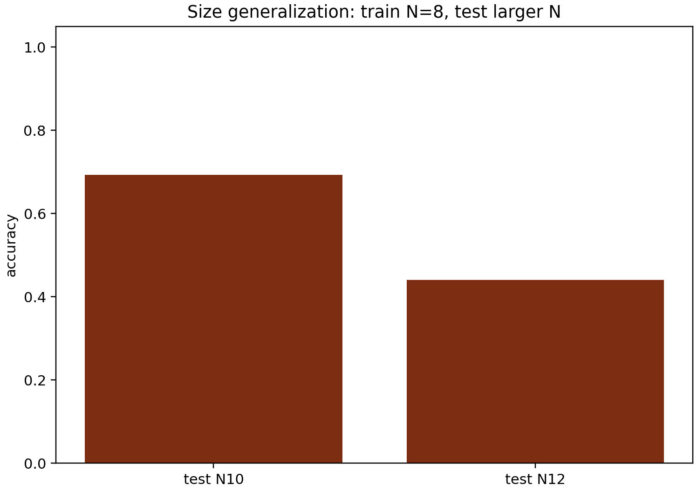

# Scientific Findings Pack

Generated at UTC: 2026-04-22T00:40:41.357635+00:00
Campaign: `C:\Users\Pedro Henrique\Downloads\Assyntrax-main\repos\Quantum-systems\outputs\transport_networks\scientific_validation\latest`

## Executive Reading

- Verdict: `strong_candidate`.
- Open signatures: 810.
- Group split combined accuracy: 0.556.
- Group split baseline: 0.133.
- Classical-only group accuracy: 0.183.
- Strongest mean dephasing gain: 0.263.
- Numerics pass: True.

## Paper Guardrails

- Matched: ['Mulken/Blumen: closed-walk return probability depends on topology.', 'Razzoli: target/trap placement changes transport efficiency.', 'Mohseni/Plenio/Rebentrost: nonzero dephasing can improve target arrival.', 'Mohseni/Plenio/Rebentrost: high dephasing suppression appears after the optimum.'].
- Failed: [].
- Uncertain: [].

## Paper-By-Paper Reproduction Status

| Paper | Verdict | Claims | Mean confidence |
|---|---:|---:|---:|
| `blach_2025` | `matched` | 2 | 0.90 |
| `caruso_2009` | `matched` | 1 | 1.00 |
| `coates_2023` | `inconclusive` | 1 | 0.35 |
| `engel_2007` | `not_applicable` | 1 | 1.00 |
| `gamble_2010` | `not_applicable` | 1 | 1.00 |
| `kendon_2007` | `matched` | 1 | 1.00 |
| `maier_2019` | `matched` | 2 | 0.90 |
| `minello_2019` | `matched` | 1 | 1.00 |
| `mohseni_2008` | `matched` | 1 | 1.00 |
| `muelken_blumen_2011` | `matched` | 1 | 1.00 |
| `novo_2016` | `matched` | 1 | 1.00 |
| `plenio_huelga_2008` | `matched` | 1 | 1.00 |
| `razzoli_2021` | `matched` | 2 | 0.87 |
| `rebentrost_2009` | `matched` | 1 | 0.85 |
| `rojo_francas_2024` | `not_applicable` | 1 | 1.00 |
| `rossi_2015` | `matched` | 1 | 1.00 |
| `whitfield_2010` | `matched` | 1 | 1.00 |

## Figures

### Closed coherent benchmark

Control without target loss, dephasing, or disorder. Different curves mean topology is visible in the dynamics.

### Target placement

Shows how changing only the successful-arrival node changes transport.

### Dephasing gain with uncertainty

Positive bars mean phase scrambling improved target arrival relative to zero dephasing.

### Quantum/open versus classical

Points above the diagonal mean the quantum/open model arrived better than the classical rate control.

### Classification honesty check

Compares optimistic row split against honest graph-instance group split.

### Size generalization

Trains at N=8 and tests at larger N when available.

## Next Action

Run a focused confirm/refinement campaign for `modular_two_community + unweighted + near target`. Do not expand to new physics layers before this validation step.
